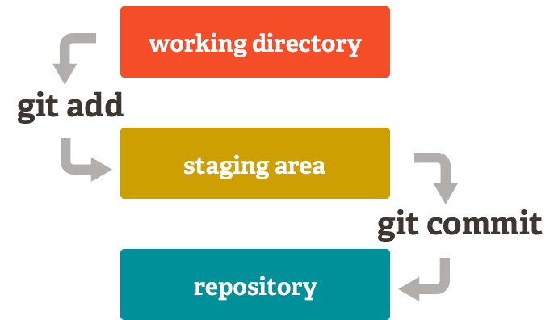
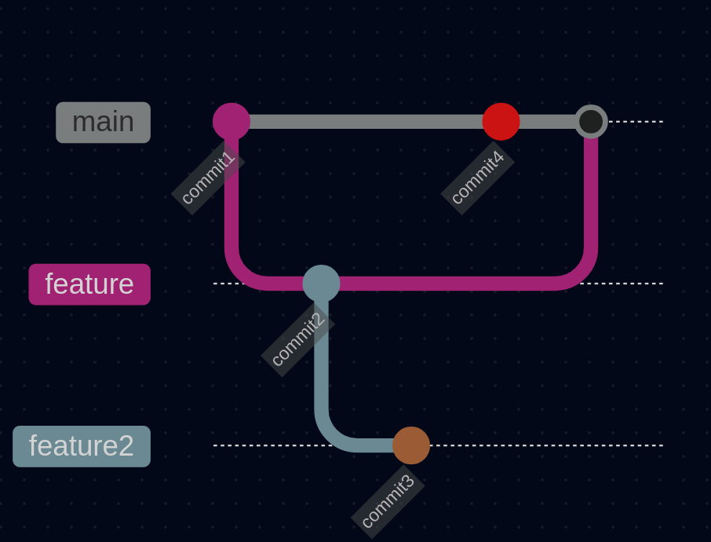
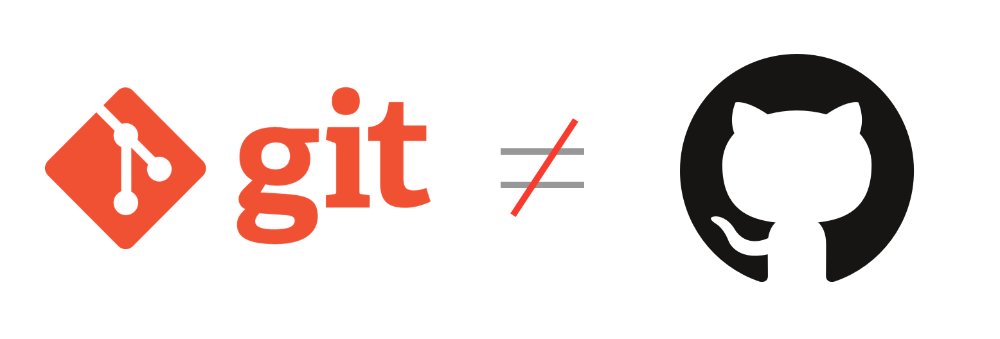
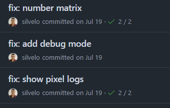

  <!-- _paginate: skip -->

  <div class="front">
    <h1 class="title"> Git Básico </h1>
    <hr class="line"/>
    <p class="author">Arturo Silvelo</p>
    <p class="company">Try New Roads</p>
  </div>

---

# Introducción

---

## ¿Por qué necesitamos un control de versiones?

<div class="container-image">
   
</div>

---

## ¿Qué es un control de versiones?

**Version Control System o VCS** es una herramienta esencial en el desarrollo de software y la gestión de proyectos. Permite gestionar los cambios realizados en un archivo o conjunto de archivos a lo largo del tiempo, facilitando el seguimiento de modificaciones, la colaboración entre equipos y la recuperación de versiones anteriores.


---

### Beneficios clave

- **Colaboración:** Permite que varias personas trabajen simultáneamente en el mismo proyecto, integrando cambios de manera eficiente y evitando conflictos

- **Trazabilidad:** Registra el historial completo de modificaciones, facilitando el seguimiento de quién hizo cada cambio y cuándo

- **Recuperación:** Posibilita volver a versiones anteriores del proyecto o restaurar archivos eliminados accidentalmente

---

### Ejemplos de VCS

- Git: _Distribuido_
- Subversion (SVN): _Centralizado_
- Mercurial (hg): _Distribuido_
- Perforce (Helix Core): _Centralizado y distribuido_

---

## ¿Qué es Git?

**Git** es un sistema distribuido de control de versiones, **gratuito** y de **código abierto**, desarrollado por **Linus Torvalds** en 2005. Está diseñado para mejorar:

- **Rendimiento** de las operaciones.
- Uso eficiente del **espacio de almacenamiento**
- **Distribuido:** Eliminar la necesidad de un servidor central

---

## Fundamentos de Git

- **Repositorios:** Un repositorio es un espacio donde se almacenan los archivos y su historial de versiones. Pueden ser **locales** (en tu máquina) o **remotos** (en un servidor).
- **Ramas:** Git utiliza un sistema de ramas, donde cada proyecto tiene al menos una rama principal (por defecto llamada `main` o `master`). Las ramas permiten trabajar en paralelo sin interferir con la versión principal.

---

## Estados de los Archivos

**Estados de los archivos:** En Git, los archivos pasan por diferentes **estados** en su ciclo de vida:

- **Modificado (modified):** El archivo ha cambiado, pero aún no está preparado para ser confirmado.
- **Preparado (staged):** El archivo está listo para ser confirmado.
- **Confirmado (committed):** El archivo ha sido guardado en el historial del repositorio.


----

<div class=container-image>
  
</div>

---

## ¿Qué es una rama?

Una **rama** es una versión de la colección de directorios y archivos del repositorio. Cada vez que se crea una rama, se crea una **copia** de la colección de archivos actual.

Se pueden crear **ramas a partir de otras ramas**. Los cambios realizados en esas ramas pueden ser **integrados en otras ramas**. Este proceso se conoce como **merge** (fusión).

---


<div class=container-image>
  
</div>

---

## ¿Para qué sirven las ramas?

Las ramas son útiles en un **entorno de colaboración**, donde diferentes personas están trabajando en el mismo código. Mientras una persona puede estar añadiendo una nueva funcionalidad al código, otra podría estar arreglando un **bug** y otra añadiendo **documentación**.

De esta forma, partiendo del mismo código, se generan diferentes **ramas**. Esto permite **aislar el trabajo** de cada persona, y una vez finalizado, se pueden integrar esos cambios en la rama principal.

---

## La rama master o la rama main

La rama **master** ha sido tradicionalmente la rama principal de un repositorio, y suele ser creada automáticamente cuando se inicia un nuevo proyecto en Git. Aunque históricamente se ha utilizado el nombre **master** para esta rama, **no es obligatorio** que se llame de esta manera, ya que su elección responde a razones históricas y no tiene implicaciones técnicas.

En la actualidad, muchos proyectos y plataformas, como GitHub, recomiendan cambiar el nombre de la rama principal a **main**. Esta recomendación busca evitar connotaciones negativas y racistas asociadas al término **master**, promoviendo un lenguaje más inclusivo.


---

## Git, GitHub y GitLab

**Git** es el sistema de control de versiones que permite gestionar proyectos de manera local. Aunque es posible configurar un servidor remoto propio, esto requiere tiempo y recursos, lo que no siempre es rentable.



Aquí es donde entran plataformas como **GitHub** y **GitLab**, que ofrecen alojamiento en la nube basado en Git, con interfaces gráficas amigables y servicios adicionales como **CI/CD** y **gestión de proyectos**, facilitando la colaboración remota y el flujo de trabajo.

---

# Instalar y Configurar Git

---

## Instalar Git

Comprueba si _git_ está instalado, si está mostrará la versión:

```bash
git --version
```

---

La instalación de Git varía según el sistema operativo:

- **Windows:** Descargar desde [https://git-scm.com/](https://git-scm.com/) y seguir las instrucciones predeterminadas.
- **Linux:** Descargar desde [https://git-scm.com/downloads/linux](https://git-scm.com/downloads/linux) o utilizar el siguiente comando:
  - En **Debian/Ubuntu**: `sudo apt install git`
  - En **Fedora**: `sudo dnf install git`
- **Mac:** Usar **Homebrew**: `brew install git` o descargar desde [https://git-scm.com/](https://git-scm.com/).

---

## Configurar Git

Antes de empezar a usar Git, es recomendable hacer una configuración mínima para asociar tus commits con tu nombre y correo electrónico.

Para que tus commits se asocien correctamente a tu nombre y aparezcan de forma adecuada en plataformas como GitHub, necesitas realizar la siguiente configuración:

```bash
git config --global user.name "Arturo Silvelo"
git config --global user.email "arturo.silvelo@gmail.com"
```

---

Si quieres cambiar la configuración para un repositorio en particular, puedes eliminar la opción `--global` y configurarlo directamente en el repositorio:

```bash
cd <tu-repositorio>
git config user.name "silvelo"
git config user.email "silvelo@work.com"
```



---

Por defecto, Git intenta abrir el editor `vim` para modificar los archivos cuando encuentra conflictos o para escribir el mensaje del commit.

Se puede cambiar esta configuración para que Git abra el editor de texto de tu elección. Por ejemplo, para usar Visual Studio Code, ejecuta el siguiente comando:

```bash
git config --global core.editor "code"
```

---

La opción **core.autocrlf** controla cómo Git maneja los saltos de línea entre diferentes sistemas operativos.

**Opciones:**

- `true`: Convierte los saltos de línea de tipo `CRLF` (Windows) a `LF` (Linux/Mac) al hacer commit.
- `input`: No modifica los saltos de línea al hacer commit, pero convierte `CRLF` a `LF` al hacer `checkout`.
- `false`: No realiza ninguna conversión.

---

Ejemplo de configuración:

```bash
git config --global core.autocrlf true  # En Windows
git config --global core.autocrlf input  # En Linux/Mac
```

---

Los alias permiten acortar y personalizar comandos largos de Git, haciendo que tu flujo de trabajo sea más eficiente.

**Ejemplos de alias comunes:**

- `st` para `status`
- `co` para `checkout`
- `br` para `branch`

---

Ejemplo de configuración de alias:

```bash
git config --global alias.st status  # `git st` en lugar de `git status`
git config --global alias.co checkout  # `git co` en lugar de `git checkout`
```


---

## Comprobar Configuración de Git

Para revisar la configuración actual de Git, usa el comando:

```bash
git config --list
```

---

Git tiene varios archivos de configuración:

- `local`: Para el repositorio actual.
- `global`: Para todos los repositorios del usuario.
- `system`: Para todos los usuarios del sistema.

**El último valor prevalece.**

Además, puedes usar los siguientes filtros para comprobar la configuración:

- `--local`, `--global`, `--system` para filtrar.
- `--show-scope` para saber de dónde proviene cada valor.
