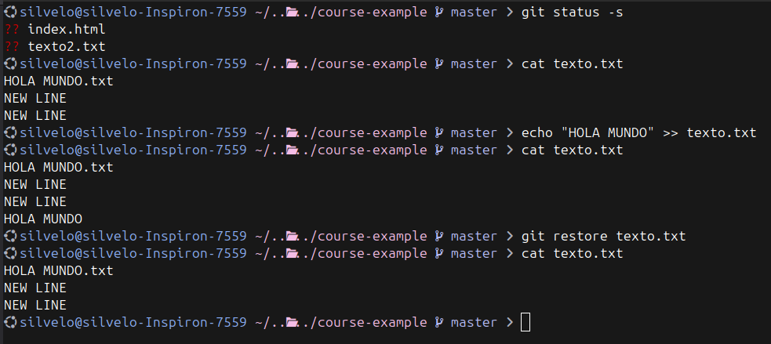

  <!-- _paginate: skip -->

  <div class="front">
    <h1 class="title"> Git Básico </h1>
    <hr class="line"/>
    <p class="author">Arturo Silvelo</p>
    <p class="company">Try New Roads</p>
  </div>

---

# Trabajando Local

---

## Git de forma local


---

## Iniciar un nuevo proyecto

Para crear un nuevo proyecto en Git, usa el comando:

```bash
git init <nombre del proyecto>
```

Si ya tienes un directorio creado y deseas convertirlo en un repositorio de Git, navega a él con:

```bash
cd <directorio>
git init
```

---

<div class=container-image>

</div>

---

En ambos casos, Git crea una rama principal por defecto y el directorio `.git` se genera para almacenar toda la información del proyecto.

Para comprobar si tu proyecto tiene un repositorio inicializado, puedes usar el comando:

```bash
git status
```

---

<div class=container-image>

</div>

---

## Directorio de trabajo

El **directorio de trabajo** es la carpeta donde tienes todos los archivos y en la que has iniciado tu repositorio.

Creamos un nuevo archivo con el comando:

```bash
touch index.html
```

Luego, revisamos el estado del repositorio con:

```bash
git status
```

---

Esto mostrará que el archivo `index.html` ha sido añadido y está en estado **modificado**.

Para obtener una vista más simplificada, puedes usar:

```bash
git status -s
```

---

<div class=container-image>

</div>


---


## Staging

---


### Añadir Staging

El área de `staging` es una zona temporal donde preparamos los archivos modificados antes de confirmarlos con un `commit`.

```bash
git add index.html        # Prepara el archivo index.html
git add archivo1.js archivo2.js   # Prepara varios archivos
git add *.js               # Prepara todos los archivos .js
git add -A                 # Prepara todos los cambios (incluyendo eliminaciones)
git add .                  # Prepara todos los cambios en el directorio actual
git add resources/         # Prepara todos los archivos en el directorio resources
```

---

<div class=container-image>

</div>

---

### Sacar archivos de Staging

Podemos eliminar los ficheros del área de `staging` y devolverlos al estado de modificados con el comando `git reset`.

```bash
git reset index.html          # Elimina index.html del área de staging
git reset archivo1.js archivo2.js   # Elimina varios archivos del área de staging
git reset *.js                # Elimina todos los archivos .js del área de staging
git reset -A                  # Elimina todos los archivos del área de staging
git reset .                   # Elimina todos los cambios del directorio actual del área de staging
git reset resources/          # Elimina todos los archivos del directorio resources del área de staging
```

---

<div class=container-image>

</div>


---

## Commit

---

## ¿Qué es un commit?

Los commits sirven para registrar los cambios que se han producido en el repositorio. Cada commit muestra el estado de todos los archivos del repositorio, el autor, la fecha y otra información útil.


---

## ¿Cómo hacer un commit?

Para guardar los ficheros del área de `staging`, se utiliza el comando:

```bash
git commit   # Este comando creará una referencia al commit
```

Este comando abrirá el editor para que puedas poner un mensaje de commit. Si quieres añadir el mensaje directamente en el comando, puedes usar la opción `-m`:

```bash
git commit -m 'new feature'   # Realiza un commit con el mensaje 'new feature'
```

---


<div class=container-image>

</div>

---

## Commit sin staging

También es posible evitar añadir directamente los archivos modificados al área de `staging`. Para realizar esta operación se utiliza el comando:

```bash
git commit -a   # Realiza un commit de todos los archivos modificados sin necesidad de añadirlos a staging
```

Este comando realizará un commit directamente de los archivos modificados. Además, se puede añadir la opción `-m` para incluir el mensaje de commit directamente:

```bash
git commit -am 'new feature'   # Realiza un commit con el mensaje 'new feature' sin pasar por staging
```

<small>**Nota:** Esto sólo funciona para archivos modificados. Los archivos nuevos o eliminados necesitan ser añadidos a staging primero.</small>

---

<div class=container-image>

</div>


---

## HEAD

Cada `commit` se graba con un hash único que puede ser complicado de utilizar como referencia rápida. Para esto existe `HEAD`, que normalmente apunta al último `commit` de la rama activa.

```bash
# Mostrar la rama a la que apunta HEAD
git symbolic-ref HEAD

# Mostrar el hash del commit al que apunta HEAD
git rev-parse HEAD
```

---


<div class=container-image>

</div>


---

## Deshacer Cambios (Commits)

Si necesitamos deshacer el último `commit` porque nos hemos equivocado o faltan archivos, podemos hacerlo de dos maneras:

```bash
# Mantener los cambios
git reset --soft HEAD~1

# No mantener los cambios
git reset --hard HEAD~1
```

El `HEAD~1` indica que queremos movernos a la versión inmediatamente anterior a la actual.

**Nota:** Esto solo funcionará si los cambios no se han subido al repositorio remoto.

---

<div class=container-image>

</div>

---

<div class=container-image>

</div>


---

## Arreglar Commit

Si lo único que necesitamos es corregir el último `commit`:

```bash
# Editar el mensaje
git commit --amend -m 'Nuevo mensaje'

# Añadir archivos y modificar el commit
git add archivo3.js
git commit --amend -m 'Nuevo mensaje'
```

El comando `amend` no crea un nuevo `commit`, sino que actualiza el anterior.

---

<div class=container-image>

</div>


---

## Deshacer cambios

---

### Deshacer un archivo modificado (Usando `git restore`)

Si modificamos un archivo y queremos volver al estado inicial, podemos usar el comando:

```bash
git restore index.html
git restore .
git restore '*.js'
```

**Nota:** Este comando hará que los cambios se pierdan. Si el archivo no está guardado en un commit previo, Git nos dará un error.

---

<div class=container-image>

</div>


---

<div class=container-image>

</div>

---

### Deshacer un archivo modificado (Usando `git checkout`)

El comando `git restore` es relativamente nuevo, y puede que no esté disponible en versiones antiguas de Git. En ese caso, podemos usar como alternativa:

```bash
git checkout -- index.html
git checkout -- '*.md'
git checkout .
```

Estos comandos tienen la misma función que `git restore`, restaurando el archivo o conjunto de archivos al estado anterior.

---

## Eliminar archivos no rastreados (Usando `git clean`)

Si queremos eliminar archivos no rastreados del directorio de trabajo, podemos usar el comando `git clean`.

```bash
touch index2.html
git clean
```

---

Opciones principales de `git clean`:

- `-n`: Muestra qué se eliminaría sin ejecutar la acción.
- `-f`: Fuerza la eliminación de los archivos.
- `-d`: Permite eliminar directorios no rastreados.
- `-i`: Activa el modo interactivo para confirmar cada acción.

```bash
git clean -n   # Muestra qué se eliminaría
git clean -f   # Fuerza la limpieza
```

---


<div class=container-image>

</div>


