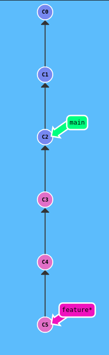
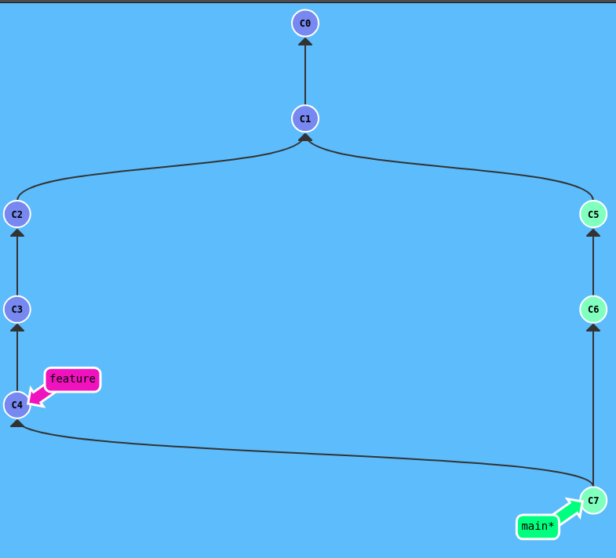
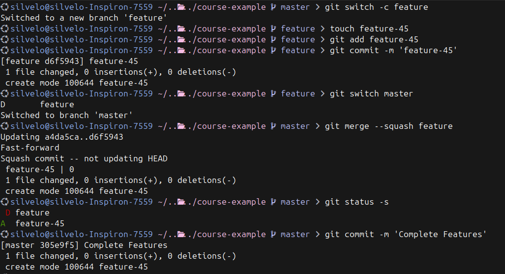

  <!-- _paginate: skip -->

  <div class="front">
    <h1 class="title"> Git Básico </h1>
    <hr class="line"/>
    <p class="author">Arturo Silvelo</p>
    <p class="company">Try New Roads</p>
  </div>

---


# Ramas

----


## ¿Qué es una rama?

Una **rama** (branch) en Git es una línea de desarrollo independiente que permite:

- Trabajar en nuevas características sin afectar el código principal
- Experimentar con cambios de forma segura
- Colaborar en paralelo con otros desarrolladores
- Mantener un historial limpio y organizado

---

<div class="container-image">
  
</div>

---

## Ventajas de usar ramas


- **Aislamiento**: Los cambios en una rama no afectan otras ramas
- **Experimentación**: Puedes probar ideas sin riesgo
- **Colaboración**: Múltiples desarrolladores pueden trabajar simultáneamente
- **Organización**: Cada característica o bug fix tiene su propia rama
- **Historial limpio**: Facilita el seguimiento de cambios


---

## Crear una rama

Para crear una nueva rama se pueden usar diferentes comandos

- Crear solo la rama (sin cambiar a ella)

    ```bash
    git branch feature
    ```
    Para cambiar a la rama creada:

    ```
    git switch feature
    # ó
    git checkout feature
    ```
---

- Crear la rama y cambiar a ella:

    ```bash
    git switch -c feature
    git checkout -b feature
    ```


- Crear rama desde un commit específico:

    ```bash
    git branch feature abc1234
    git switch -c feature abc1234
    ```

---

## Listar ramas

- Ver ramas locales:

    ```bash
    git branch
    ```
    La rama actual tendrá un asterisco al inicio.

- Ver todas las ramas (locales y remotas):

    ```bash
    git branch -a
    ```

---

- Ordenar por fecha de modificación:

    ```bash
    git branch --sort=-committerdate
    ```

- Ver información detallada:
    
    ```bash
    git branch -v
    ```


---

# Trabajando Con Ramas

---


## Escenario inicial

Tu equipo está trabajando en un proyecto y necesitan manejar múltiples tareas simultáneamente.

**Tareas a realizar:**

1. **Nueva característica**: Te asignan desarrollar `feature-1` 
2. **Bug crítico**: Durante el desarrollo encuentras un error que necesita solución inmediata
3. **Desarrollo paralelo**: Un compañero debe crear `feature-2` al mismo tiempo
4. **Segundo bug**: Se reporta otro error en la aplicación principal mientras todos trabajan

---

### Cargar el nivel

1. [Learn Git Branching](https://learngitbranching.js.org/?NODEMO) 
2. Escribimos `import level`
3. Copiamos el fichero `ejercicios_1.json` y lo pegamos.

---

<div class="container-image">
  
</div>


---

# Fusionar Ramas

---

## ¿Qué es fusionar (merge)?

**Fusionar** es el proceso de **integrar los cambios** de una rama en otra rama.

- Los commits de la rama origen se incorporan a la rama destino
- Se crea un historial unificado
- Permite combinar el trabajo de diferentes desarrolladores
- Mantiene la trazabilidad de los cambios

---

- Comando básico de fusión

    ```
    git merge <rama-origen>
    ```

    Ejemplo:

    ```bash
    # 1. Cambiar a la rama destino
    git switch main

    # 2. Fusionar la rama feature
    git merge feature-1
    ```

<div >
💡 <strong>Importante:</strong> Siempre debes estar en la rama destino antes de hacer merge
</div>

---

## Tipos de merge

---

## Fast-forward

- Cuando no hay commits nuevos en la rama destino
- Simplemente mueve el puntero hacia adelante

``` bash
git merge --ff-only my-branch
```

---

<div class="container-image-col ">

<div class="image-col">
  
</div>

<div class="image-col">


```bash
# Creamos la nueva rama
git switch -c feature

# Añadimos cambios
git commit
git commit
git commit

# Volvemos a la rama principal
git switch main

# Fusionamos las ramas
git merge --ff-only feature 

# ó
git merge feature

```
</div>


<div class="image-col">
  
</div>
</div>

---


## No Fast-forward

- Cuando ambas ramas tienen commits nuevos
- Crea un commit de fusión que une ambas historias
- Preserva la estructura de ramas en el historial

``` bash
git merge --no-ff my-branch
```

---

<div class="container-image-col ">

<div class="image-col">
  
</div>

<div class="image-col">


```bash
# Creamos la nueva rama
git switch -c feature

# Añadimos cambios
git commit
git commit
git commit

# Volvemos a la rama principal
git switch main

# Añadimos cambios
git commit
git commit
git commit

# Fusionamos las ramas
git merge --no-ff feature 

# ó
git merge feature

```
</div>


<div class="image-col">
  
</div>
</div>

---

## Squash Merge

- Combina todos los commits de una rama en un solo commit
- Crea un historial más limpio y lineal
- Útil cuando la rama tiene muchos commits pequeños o experimentales

```bash
git merge --squash feature
git commit -m "Add complete feature X"
```

---

<div class="container-image-col ">

<div class="image-col">
  
</div>

<div class="image-col">

```bash
# Creamos la nueva rama
git switch -c feature

# Añadimos múltiples commits
git commit -m "F1"
git commit -m "F2"
git commit -m "F3"

# Volvemos a main
git switch main

# Squash merge: combina todos en uno
git merge --squash feature
git commit -m "Feature Complete"
git commit -m "C3"
```

</div>

<div class="image-col">
  
</div>

</div>

---

## Personalizar mensajes de merge

Puedes modificar el mensaje de un merge usando `--edit` y `--no-commit`:

- **`--edit`**: Abre el editor para modificar el mensaje automático
- **`--no-commit`**: Realiza el merge sin crear el commit automáticamente

---

## Comportamiento por tipo de merge

**Fast-forward merge:**
```bash
git merge --edit feature          # ❌ No funciona (no hay commit de merge)
git merge --no-commit feature     # ✅ Evita fast-forward, deja cambios en staging
```
---

**No Fast-forward merge:**
```bash
git merge --edit --no-ff feature     # ✅ Abre editor para mensaje
git merge --no-commit --no-ff feature # ✅ Prepara merge sin commitear
```

---

**Squash merge:**
```bash
git merge --squash feature           # ✅ Siempre requiere commit manual
git merge --squash --edit feature    # ✅ Redundante (ya controlas el mensaje)
```

---

## Ejemplos prácticos


- git merge --edit --no-ff feature

<div class="container-image-col ">

<div class="image-col">
  
</div>


<div class="image-col">
  
</div>

</div>


---

- git merge --no-commit --no-ff feature 


<div class="container-image">
  
</div>


---

- git merge --squash feature

<div class="container-image">
  
</div>

---

<div class="container-image">
  
</div>

---

# Conflictos de Merge

---


## ¿Qué es un conflicto?


Un **conflicto** ocurre cuando Git no puede fusionar automáticamente los cambios porque:

- Dos ramas modificaron las **mismas líneas** en el mismo archivo
- Una rama modificó un archivo que otra rama eliminó
- Ambas ramas crearon archivos con el **mismo nombre**

Git necesita **tu ayuda** para decidir qué cambios mantener.

---


## ¿Cuándo ocurren los conflictos?

**Escenarios comunes:**

- Dos desarrolladores editan la misma función
- Cambios en la misma línea de código
- Modificaciones simultáneas en archivos de configuración
- Refactorización que afecta las mismas secciones

**Git puede fusionar automáticamente:**
- Cambios en líneas diferentes del mismo archivo
- Cambios en archivos diferentes
- Adición de nuevas líneas sin solapamiento

---


## Identificar un conflicto

Cuando ocurre un conflicto, Git te muestra:

```bash
$ git merge feature
Auto-merging file.txt
CONFLICT (content): Merge conflict in file.txt
Automatic merge failed; fix conflicts and then commit the result.
```

**Verificar estado:**
```bash
git status
# On branch main
# You have unmerged paths.
# Unmerged paths:
#   both modified:   file.txt
```

---

## Anatomía de un conflicto

Git marca los conflictos en el archivo con marcadores especiales:

```
<<<<<<< HEAD
Código de la rama actual (main)
=======
Código de la rama que se está fusionando (feature)
>>>>>>> feature
```
---

**Ejemplo real:**
```javascript
function saludar() {
<<<<<<< HEAD
    return "Hola Mundo";
=======
    return "Hello World";
>>>>>>> feature
}
```


## Abortar un merge

Si decidimos **no continuar** con el merge después de encontrar conflictos:

```bash
# Abortar el merge y volver al estado anterior
git merge --abort
```

---

## ¿Cuándo usar merge --abort?
- Los conflictos son demasiado complejos
- Te das cuenta de que no era el momento adecuado para el merge
- Prefieres resolver los conflictos de otra manera
- Necesitas consultar con el equipo antes de decidir

**Resultado:**
- Vuelve al estado anterior al merge
- No se pierde ningún trabajo
- Puedes intentar el merge más tarde


---

## Comandos útiles durante conflictos

```bash
# Ver estado actual del merge
git status

# Ver qué archivos tienen conflictos
git diff --name-only --diff-filter=U

# Abortar el merge completamente
git merge --abort

# Ver diferencias entre las versiones
git diff HEAD..feature
git diff HEAD..HEAD~1

# Después de resolver conflictos
git add archivo-resuelto.txt
git commit  # Completa el merge
```

---

## Resolver conflictos automáticamente

Git ofrece estrategias para resolver conflictos automáticamente:

**Opción `-X ours`**: Favorece cambios de la rama actual
```bash
git merge -X ours feature
```

**Opción `-X theirs`**: Favorece cambios de la rama que se fusiona
```bash
git merge -X theirs feature
```

---


## Resolver conflictos durante el merge

Si **ya estamos en medio de un conflicto**, puedes resolverlos automáticamente:

```bash
# Resolver TODOS los conflictos favoreciendo nuestra rama
git checkout --ours .
git add .
git commit

# Resolver TODOS los conflictos favoreciendo la otra rama
git checkout --theirs .
git add .
git commit
```

---

## Resolver por archivo específico

```bash
# Durante un conflicto activo:
git status  # Ver archivos en conflicto

# Elegir versión por archivo
git checkout --ours archivo1.txt
git checkout --theirs archivo2.txt

# Completar el merge
git add .
git commit
```

---

# Borrar Ramas

---

## ¿Por qué borrar ramas?


**Ventajas de borrar ramas fusionadas:**
- Mantener el repositorio limpio y organizado
- Evitar confusión con ramas obsoletas
- Reducir la lista de ramas al hacer `git branch`
- Liberar espacio (aunque Git es eficiente)

**¿Cuándo borrar?**
- Después de fusionar exitosamente una feature
- Cuando una rama experimental ya no es necesaria
- Al finalizar un hotfix integrado

---

## Borrar ramas locales

**Borrado seguro (solo ramas fusionadas):**
```bash
git branch -d feature-completada
```

**Borrado forzado (cualquier rama):**
```bash
git branch -D feature-experimental
```

---

## Diferencias entre -d y -D

**`git branch -d` (delete):**
- Solo borra ramas **completamente fusionadas**
- Git te protege de perder trabajo
- Recomendado para uso normal

**`git branch -D` (Delete forzado):**
- Borra **cualquier rama** sin verificar
- Útil para ramas experimentales o squash merge
- ⚠️ **Cuidado**: Puedes perder trabajo no fusionado

---


## Ejemplos por tipo de merge

**Después de Fast-forward o No Fast-forward:**
```bash
git merge feature-login
git branch -d feature-login  # ✅ Funciona sin problemas
```

**Después de Squash merge:**
```bash
git merge --squash feature-payment
git commit -m "Add payment system"
git branch -d feature-payment  # ❌ Error: no está fusionada
git branch -D feature-payment  # ✅ Funciona (forzado)
```
---

<div class="container-image">
  
</div>

---

## Borrar múltiples ramas

```bash
# Borrar varias ramas específicas
git branch -d feature-1 feature-2 hotfix-bug

# Borrar todas las ramas fusionadas (excepto main)
git branch --merged | grep -v main | xargs git branch -d

# Ver ramas no fusionadas antes de borrar
git branch --no-merged
```

---

## Recreando ramas borradas

Si borraste una rama por error, puedes recuperarla:

```bash
# Encontrar el commit de la rama borrada
git reflog

# Recrear la rama desde el commit
git branch rama-recuperada abc1234

# O directamente hacer checkout
git checkout -b rama-recuperada abc1234
```

**💡 Consejo:** Git mantiene los commits durante ~30 días por defecto

---

# Rebase

---

## ¿Qué es rebase?

**Rebase** es una alternativa a merge que **reescribe el historial** para crear una línea de desarrollo más limpia y lineal.


- **Reaplica commits** de una rama sobre otra
- **Cambia la base** de donde se originó la rama
- **Crea historial lineal** sin commits de merge
- **Reescribe hashes** de los commits movidos


---

## [Rebase vs Merge](https://learngitbranching.js.org/?NODEMO&command=importTreeNow%20%7B%22branches%22%3A%7B%22main%22%3A%7B%22remoteTrackingBranchID%22%3Anull%2C%22remote%22%3Afalse%2C%22target%22%3A%22C9%22%2C%22id%22%3A%22main%22%2C%22type%22%3A%22branch%22%7D%2C%22feature%22%3A%7B%22remoteTrackingBranchID%22%3Anull%2C%22remote%22%3Afalse%2C%22target%22%3A%22C5%22%2C%22id%22%3A%22feature%22%2C%22type%22%3A%22branch%22%7D%7D%2C%22commits%22%3A%7B%22C0%22%3A%7B%22type%22%3A%22commit%22%2C%22parents%22%3A%5B%5D%2C%22author%22%3A%22Peter%20Cottle%22%2C%22createTime%22%3A%22Tue%20Sep%2023%202025%2011%3A18%3A32%20GMT+0200%20%28Central%20European%20Summer%20Time%29%22%2C%22commitMessage%22%3A%22Quick%20commit.%20Go%20Bears%21%22%2C%22id%22%3A%22C0%22%2C%22rootCommit%22%3Atrue%7D%2C%22C1%22%3A%7B%22type%22%3A%22commit%22%2C%22parents%22%3A%5B%22C0%22%5D%2C%22author%22%3A%22Peter%20Cottle%22%2C%22createTime%22%3A%22Tue%20Sep%2023%202025%2011%3A18%3A32%20GMT+0200%20%28Central%20European%20Summer%20Time%29%22%2C%22commitMessage%22%3A%22Quick%20commit.%20Go%20Bears%21%22%2C%22id%22%3A%22C1%22%7D%2C%22C2%22%3A%7B%22type%22%3A%22commit%22%2C%22parents%22%3A%5B%22C1%22%5D%2C%22author%22%3A%22Peter%20Cottle%22%2C%22createTime%22%3A%22Tue%20Sep%2023%202025%2011%3A18%3A32%20GMT+0200%20%28Central%20European%20Summer%20Time%29%22%2C%22commitMessage%22%3A%22Quick%20commit.%20Go%20Bears%21%22%2C%22id%22%3A%22C2%22%7D%2C%22C3%22%3A%7B%22type%22%3A%22commit%22%2C%22parents%22%3A%5B%22C2%22%5D%2C%22author%22%3A%22Peter%20Cottle%22%2C%22createTime%22%3A%22Tue%20Sep%2023%202025%2011%3A18%3A32%20GMT+0200%20%28Central%20European%20Summer%20Time%29%22%2C%22commitMessage%22%3A%22Quick%20commit.%20Go%20Bears%21%22%2C%22id%22%3A%22C3%22%7D%2C%22C4%22%3A%7B%22type%22%3A%22commit%22%2C%22parents%22%3A%5B%22C3%22%5D%2C%22author%22%3A%22Peter%20Cottle%22%2C%22createTime%22%3A%22Tue%20Sep%2023%202025%2011%3A18%3A32%20GMT+0200%20%28Central%20European%20Summer%20Time%29%22%2C%22commitMessage%22%3A%22Quick%20commit.%20Go%20Bears%21%22%2C%22id%22%3A%22C4%22%7D%2C%22C5%22%3A%7B%22type%22%3A%22commit%22%2C%22parents%22%3A%5B%22C4%22%5D%2C%22author%22%3A%22Peter%20Cottle%22%2C%22createTime%22%3A%22Tue%20Sep%2023%202025%2011%3A18%3A32%20GMT+0200%20%28Central%20European%20Summer%20Time%29%22%2C%22commitMessage%22%3A%22Quick%20commit.%20Go%20Bears%21%22%2C%22id%22%3A%22C5%22%7D%2C%22C6%22%3A%7B%22type%22%3A%22commit%22%2C%22parents%22%3A%5B%22C1%22%5D%2C%22author%22%3A%22Peter%20Cottle%22%2C%22createTime%22%3A%22Tue%20Sep%2023%202025%2011%3A18%3A32%20GMT+0200%20%28Central%20European%20Summer%20Time%29%22%2C%22commitMessage%22%3A%22Quick%20commit.%20Go%20Bears%21%22%2C%22id%22%3A%22C6%22%7D%2C%22C7%22%3A%7B%22type%22%3A%22commit%22%2C%22parents%22%3A%5B%22C6%22%5D%2C%22author%22%3A%22Peter%20Cottle%22%2C%22createTime%22%3A%22Tue%20Sep%2023%202025%2011%3A18%3A32%20GMT+0200%20%28Central%20European%20Summer%20Time%29%22%2C%22commitMessage%22%3A%22Quick%20commit.%20Go%20Bears%21%22%2C%22id%22%3A%22C7%22%7D%2C%22C8%22%3A%7B%22type%22%3A%22commit%22%2C%22parents%22%3A%5B%22C7%22%5D%2C%22author%22%3A%22Peter%20Cottle%22%2C%22createTime%22%3A%22Tue%20Sep%2023%202025%2011%3A18%3A32%20GMT+0200%20%28Central%20European%20Summer%20Time%29%22%2C%22commitMessage%22%3A%22Quick%20commit.%20Go%20Bears%21%22%2C%22id%22%3A%22C8%22%7D%2C%22C9%22%3A%7B%22type%22%3A%22commit%22%2C%22parents%22%3A%5B%22C8%22%5D%2C%22author%22%3A%22Peter%20Cottle%22%2C%22createTime%22%3A%22Tue%20Sep%2023%202025%2011%3A18%3A32%20GMT+0200%20%28Central%20European%20Summer%20Time%29%22%2C%22commitMessage%22%3A%22Quick%20commit.%20Go%20Bears%21%22%2C%22id%22%3A%22C9%22%7D%7D%2C%22tags%22%3A%7B%7D%2C%22HEAD%22%3A%7B%22target%22%3A%22main%22%2C%22id%22%3A%22HEAD%22%2C%22type%22%3A%22general%20ref%22%7D%7D)

<div class="container-image-col">

<div class="image-col">
  
</div>

<div class="image-col">
  
</div>

</div>


---

## Comando básico de rebase

```bash
# Cambiar a la rama que quieres rebasar
git switch feature

# Rebasar sobre main
git rebase main
```

**Resultado**: Los commits de `feature` se reaplican sobre el último commit de `main`

---

## Ventajas
- **Historial lineal y limpio** - fácil de seguir
- **Sin commits de merge** - menos "ruido" en el log
- **Fast-forward siempre posible** después del rebase
- **Mejor para revisión** de código en PRs
- **Commits agrupados** por feature

---

## Desventajas
- **Reescribe historial** - puede causar problemas en colaboración
- **Más complejo** de resolver conflictos
- **Pierde contexto** de cuándo se hizo el merge


---

## Rebase interactivo

El rebase interactivo te permite **modificar commits** durante el proceso:

```bash
# Rebase interactivo de los últimos 3 commits
git rebase -i HEAD~3

# Rebase interactivo sobre main
git rebase -i main
```

---

## Opciones del rebase interactivo

```bash
pick f7f3f6d F1: Add login form
pick 310154e F2: Add validation  
pick a5f4a0d F3: Fix typo

# Cambiar 'pick' por:
# pick   = usar commit tal como está
# reword = cambiar mensaje del commit
# edit   = pausar para editar el commit
# squash = combinar con commit anterior
# drop   = eliminar commit
```

---

## Ejemplo de rebase interactivo

**Antes:**
```bash
git log --oneline
a5f4a0d F3: Fix typo
310154e F2: Add validation
f7f3f6d F1: Add login form
c2e8f9a C2: Main work
```
---

**Configuración del rebase:**
```bash
pick f7f3f6d F1: Add login form
squash 310154e F2: Add validation
drop a5f4a0d F3: Fix typo
```


**Resultado:**
```bash
git log --oneline
b4d2c1e F1: Add login form with validation
c2e8f9a C2: Main work
```

---

## Conflictos durante rebase

Si hay conflictos durante el rebase:

```bash
# Git pausará el rebase
git status  # Ver archivos en conflicto

# Resolver conflictos manualmente
# Editar archivos...

# Continuar el rebase
git add archivo-resuelto.txt
git rebase --continue

# O abortar si es necesario
git rebase --abort
```

---

## Rebase vs Merge - ¿Cuándo usar cada uno?

- Usar Rebase cuando
    - Quieres historial lineal y limpio
    - Trabajas en feature branches personales
    - Antes de hacer merge a main
    - Para limpiar commits antes de PR

- Usar Merge cuando
    - Trabajas en equipo en la misma rama
    - Quieres preservar contexto temporal
    - En ramas públicas/compartidas
    - Para mantener trazabilidad de merges


---

## Comandos útiles para rebase

```bash
# Rebase simple
git rebase main
# Rebase interactivo
git rebase -i HEAD~3
# Continuar después de resolver conflictos
git rebase --continue
# Saltar commit problemático
git rebase --skip
# Abortar rebase
git rebase --abort
# Ver estado del rebase
git status
git log --oneline --graph
```