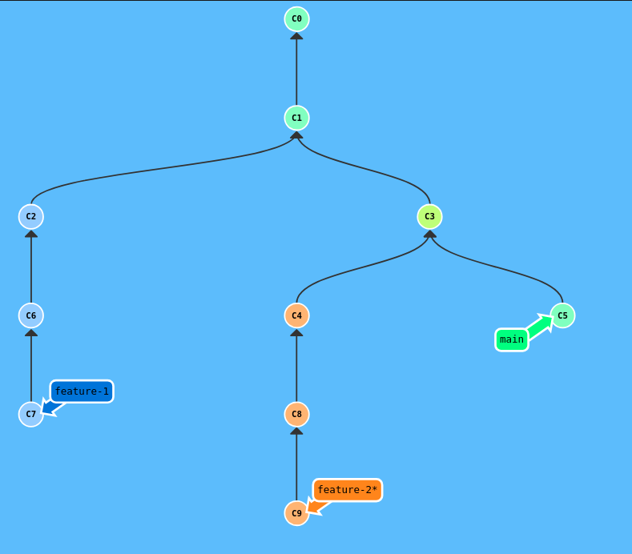

  <!-- _paginate: skip -->

  <div class="front">
    <h1 class="title"> Git Básico </h1>
    <hr class="line"/>
    <p class="author">Arturo Silvelo</p>
    <p class="company">Try New Roads</p>
  </div>

---


# Ramas

----


## 쯈u칠 es una rama?

Una **rama** (branch) en Git es una línea de desarrollo independiente que permite:

- Trabajar en nuevas características sin afectar el código principal
- Experimentar con cambios de forma segura
- Colaborar en paralelo con otros desarrolladores
- Mantener un historial limpio y organizado

---

<div class="container-image">
  
</div>

---

## Ventajas de usar ramas


- **Aislamiento**: Los cambios en una rama no afectan otras ramas
- **Experimentación**: Puedes probar ideas sin riesgo
- **Colaboración**: Múltiples desarrolladores pueden trabajar simultáneamente
- **Organización**: Cada característica o bug fix tiene su propia rama
- **Historial limpio**: Facilita el seguimiento de cambios


---

## Crear una rama

Para crear una nueva rama se pueden usar diferentes comandos

- Crear solo la rama (sin cambiar a ella)

    ```bash
    git branch feature
    ```
    Para cambiar a la rama creada:

    ```
    git switch feature
    # ó
    git checkout feature
    ```
---

- Crear la rama y cambiar a ella:

    ```bash
    git switch -c feature
    git checkout -b feature
    ```


- Crear rama desde un commit específico:

    ```bash
    git branch feature abc1234
    git switch -c feature abc1234
    ```

---

## Listar ramas

- Ver ramas locales:

    ```bash
    git branch
    ```
    La rama actual tendrá un asterisco al inicio.

- Ver todas las ramas (locales y remotas):

    ```bash
    git branch -a
    ```

---

- Ordenar por fecha de modificación:

    ```bash
    git branch --sort=-committerdate
    ```

- Ver información detallada:
    
    ```bash
    git branch -v
    ```


---

# Trabajando Con Ramas

---


## Escenario inicial

Tu equipo está trabajando en un proyecto y necesitan manejar múltiples tareas simultáneamente.

**Tareas a realizar:**

1. **Nueva característica**: Te asignan desarrollar `feature-1` 
2. **Bug crítico**: Durante el desarrollo encuentras un error que necesita solución inmediata
3. **Desarrollo paralelo**: Un compañero debe crear `feature-2` al mismo tiempo
4. **Segundo bug**: Se reporta otro error en la aplicación principal mientras todos trabajan

---

### Cargar el nivel

1. [Learn Git Branching](https://learngitbranching.js.org/?NODEMO) 
2. Escribimos `import level`
3. Copiamos el fichero `ejercicios_1.json` y lo pegamos.

---

<div class="container-image">
  
</div>


---

# Fusionar Ramas

---

## 쯈u칠 es fusionar (merge)?

**Fusionar** es el proceso de **integrar los cambios** de una rama en otra rama.

- Los commits de la rama origen se incorporan a la rama destino
- Se crea un historial unificado
- Permite combinar el trabajo de diferentes desarrolladores
- Mantiene la trazabilidad de los cambios

---

- Comando básico de fusión

    ```
    git merge <rama-origen>
    ```

    Ejemplo:

    ```bash
    # 1. Cambiar a la rama destino
    git switch main

    # 2. Fusionar la rama feature
    git merge feature-1
    ```

<div >
💡 <strong>Importante:</strong> Siempre debes estar en la rama destino antes de hacer merge
</div>

---

## Tipos de merge

---

## Fast-forward

- Cuando no hay commits nuevos en la rama destino
- Simplemente mueve el puntero hacia adelante

``` bash
git merge --ff-only my-branch
```

---

<div class="container-image-col ">

<div class="image-col">
  
</div>

<div class="image-col">


```bash
# Creamos la nueva rama
git switch -c feature

# Añadimos cambios
git commit
git commit
git commit

# Volvemos a la rama principal
git switch main

# Fusionamos las ramas
git merge --ff-only feature 

# ó
git merge feature

```
</div>


<div class="image-col">
  
</div>
</div>

---


## No Fast-forward

- Cuando ambas ramas tienen commits nuevos
- Crea un commit de fusión que une ambas historias
- Preserva la estructura de ramas en el historial

``` bash
git merge --no-ff my-branch
```

---

<div class="container-image-col ">

<div class="image-col">
  
</div>

<div class="image-col">


```bash
# Creamos la nueva rama
git switch -c feature

# Añadimos cambios
git commit
git commit
git commit

# Volvemos a la rama principal
git switch main

# Añadimos cambios
git commit
git commit
git commit

# Fusionamos las ramas
git merge --no-ff feature 

# ó
git merge feature

```
</div>


<div class="image-col">
  
</div>
</div>

---

## Squash Merge

- Combina todos los commits de una rama en un solo commit
- Crea un historial más limpio y lineal
- Útil cuando la rama tiene muchos commits pequeños o experimentales

```bash
git merge --squash feature
git commit -m "Add complete feature X"
```

---

<div class="container-image-col ">

<div class="image-col">
  
</div>

<div class="image-col">

```bash
# Creamos la nueva rama
git switch -c feature

# Añadimos múltiples commits
git commit -m "F1"
git commit -m "F2"
git commit -m "F3"

# Volvemos a main
git switch main

# Squash merge: combina todos en uno
git merge --squash feature
git commit -m "Feature Complete"
git commit -m "C3"
```

</div>

<div class="image-col">
  
</div>

</div>

---