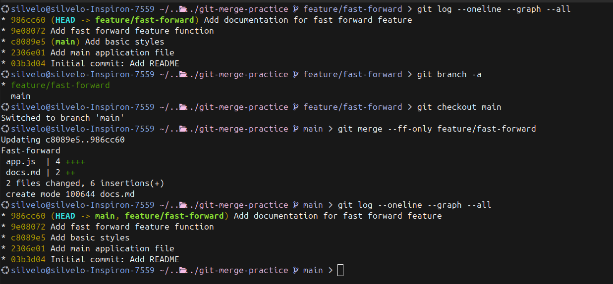
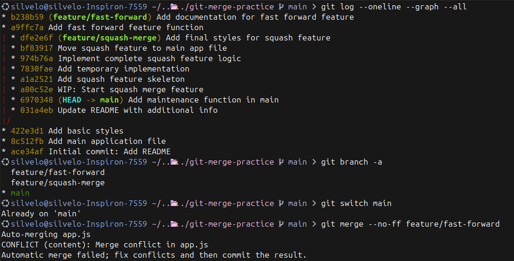
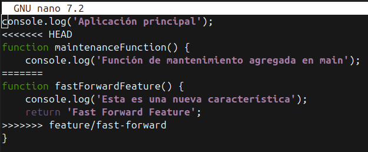
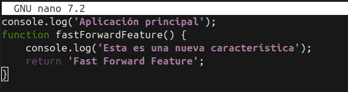
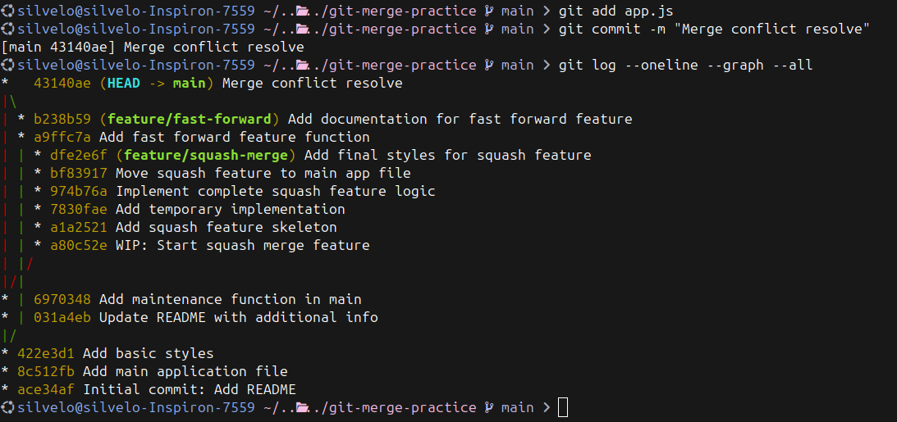
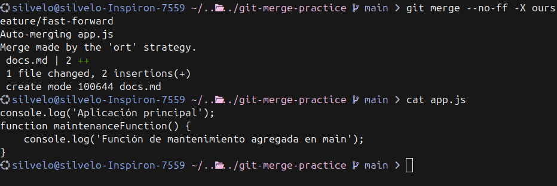
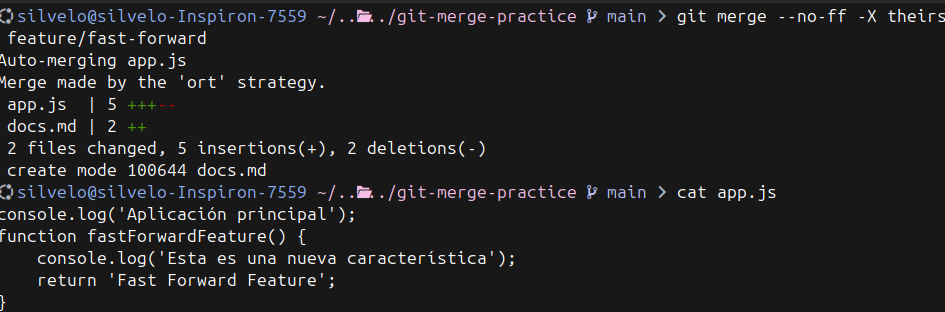
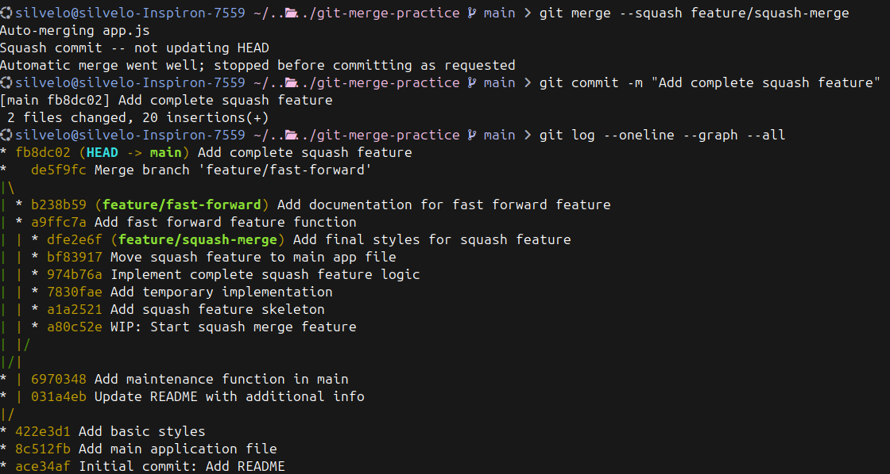

  <!-- _paginate: skip -->

  <div class="front">
    <h1 class="title"> Git Básico </h1>
    <hr class="line"/>
    <p class="author">Arturo Silvelo</p>
    <p class="company">Try New Roads</p>
  </div>

---


# Soluciones Ramas

---

## Escenario inicial

Tu equipo está trabajando en un proyecto y necesitan manejar múltiples tareas simultáneamente.

**Tareas a realizar:**

1. **Nueva característica**: Te asignan desarrollar `feature-1` 
2. **Bug crítico**: Durante el desarrollo encuentras un error que necesita solución inmediata
3. **Desarrollo paralelo**: Un compañero debe crear `feature-2` al mismo tiempo
4. **Segundo bug**: Se reporta otro error en la aplicación principal mientras todos trabajan

---

### Cargar el nivel

1. [Learn Git Branching](https://learngitbranching.js.org/?NODEMO) 
2. Escribimos `import level`
3. Copiamos el fichero `ejercicios_1.json` y lo pegamos.

---

<div class="container-image">
  
</div>


---

```bash
# Creamos la rama para trabajar en la nueva características
git switch -c feature-1
# Subimos cambios en la rama
git commit
# Nos movemos a main para arreglar el bug
git switch main
# Arreglamos el bug
git commit
# Creamos la rama para trabajar en la nueva características
git switch -c feature-2
# Subimos cambios en la rama
git commit
# Nos movemos a main para arreglar el bug
git switch main
# Arreglamos el bug
git commit
# Nos movemos a la rama para seguir trabajando en ella
git switch  feature-1
# Subimos cambios en la rama
git commit
# Subimos cambios en la rama
git commit
# Nuestro compañero sigue trabajando en su rama
git switch  feature-2
# Subimos cambios en la rama
git commit
# Subimos cambios en la rama
git commit
```


---

### Ejercicio 1: Fast-Forward Merge

```bash
# Verificar que estás en main
git switch main

# Hacer merge fast-forward
git merge --ff-only feature/fast-forward

# Verificar el resultado
git log --oneline --graph
```

[learngitbranching](https://learngitbranching.js.org/?NODEMO&command=importTreeNow%20%7B%22branches%22%3A%7B%22main%22%3A%7B%22remoteTrackingBranchID%22%3Anull%2C%22remote%22%3Afalse%2C%22target%22%3A%22C3%22%2C%22id%22%3A%22main%22%2C%22type%22%3A%22branch%22%7D%2C%22ff%22%3A%7B%22remoteTrackingBranchID%22%3Anull%2C%22remote%22%3Afalse%2C%22target%22%3A%22C6%22%2C%22id%22%3A%22ff%22%2C%22type%22%3A%22branch%22%7D%7D%2C%22commits%22%3A%7B%22C0%22%3A%7B%22type%22%3A%22commit%22%2C%22parents%22%3A%5B%5D%2C%22author%22%3A%22Peter%20Cottle%22%2C%22createTime%22%3A%22Tue%20Sep%2023%202025%2010%3A21%3A03%20GMT+0200%20%28Central%20European%20Summer%20Time%29%22%2C%22commitMessage%22%3A%22Quick%20commit.%20Go%20Bears%21%22%2C%22id%22%3A%22C0%22%2C%22rootCommit%22%3Atrue%7D%2C%22C1%22%3A%7B%22type%22%3A%22commit%22%2C%22parents%22%3A%5B%22C0%22%5D%2C%22author%22%3A%22Peter%20Cottle%22%2C%22createTime%22%3A%22Tue%20Sep%2023%202025%2010%3A21%3A03%20GMT+0200%20%28Central%20European%20Summer%20Time%29%22%2C%22commitMessage%22%3A%22Quick%20commit.%20Go%20Bears%21%22%2C%22id%22%3A%22C1%22%7D%2C%22C2%22%3A%7B%22type%22%3A%22commit%22%2C%22parents%22%3A%5B%22C1%22%5D%2C%22author%22%3A%22Peter%20Cottle%22%2C%22createTime%22%3A%22Tue%20Sep%2023%202025%2010%3A21%3A08%20GMT+0200%20%28Central%20European%20Summer%20Time%29%22%2C%22commitMessage%22%3A%22Quick%20commit.%20Go%20Bears%21%22%2C%22id%22%3A%22C2%22%7D%2C%22C3%22%3A%7B%22type%22%3A%22commit%22%2C%22parents%22%3A%5B%22C2%22%5D%2C%22author%22%3A%22Peter%20Cottle%22%2C%22createTime%22%3A%22Tue%20Sep%2023%202025%2010%3A21%3A10%20GMT+0200%20%28Central%20European%20Summer%20Time%29%22%2C%22commitMessage%22%3A%22Quick%20commit.%20Go%20Bears%21%22%2C%22id%22%3A%22C3%22%7D%2C%22C4%22%3A%7B%22type%22%3A%22commit%22%2C%22parents%22%3A%5B%22C3%22%5D%2C%22author%22%3A%22Peter%20Cottle%22%2C%22createTime%22%3A%22Tue%20Sep%2023%202025%2010%3A21%3A21%20GMT+0200%20%28Central%20European%20Summer%20Time%29%22%2C%22commitMessage%22%3A%22Quick%20commit.%20Go%20Bears%21%22%2C%22id%22%3A%22C4%22%7D%2C%22C5%22%3A%7B%22type%22%3A%22commit%22%2C%22parents%22%3A%5B%22C4%22%5D%2C%22author%22%3A%22Peter%20Cottle%22%2C%22createTime%22%3A%22Tue%20Sep%2023%202025%2010%3A21%3A22%20GMT+0200%20%28Central%20European%20Summer%20Time%29%22%2C%22commitMessage%22%3A%22Quick%20commit.%20Go%20Bears%21%22%2C%22id%22%3A%22C5%22%7D%2C%22C6%22%3A%7B%22type%22%3A%22commit%22%2C%22parents%22%3A%5B%22C5%22%5D%2C%22author%22%3A%22Peter%20Cottle%22%2C%22createTime%22%3A%22Tue%20Sep%2023%202025%2010%3A21%3A24%20GMT+0200%20%28Central%20European%20Summer%20Time%29%22%2C%22commitMessage%22%3A%22Quick%20commit.%20Go%20Bears%21%22%2C%22id%22%3A%22C6%22%7D%7D%2C%22tags%22%3A%7B%7D%2C%22HEAD%22%3A%7B%22id%22%3A%22HEAD%22%2C%22target%22%3A%22ff%22%2C%22type%22%3A%22general%20ref%22%7D%7D)

---


<div class="container-image">
  
</div>

---


### Ejercicio 2: No Fast-Forward Merge

---
<div class="container-image-col">
  <div class="image-col">

```bash
# Verificar que estás en main
git branch -a
git switch main

# Ver estado logs
git log --oneline --graph

# Realizar el merge
git merge --no-ff feature/fast-forward
```
  </div>
  <div class="image-col">
    
  </div>
</div>


---
<div class="container-image-col">
  <div class="image-col">
  
</div>
<div class="image-col">
  
</div>
</div>

---


<div class="container-image-col">
  <div class="image-col">

```bash
# Añadir el fichero
git add app.js

# Crear el commit
git commit -m "Merge conflict resolve"

# Ver estado logs
git log --oneline --graph

```
  </div>
  <div class="image-col">
      
  </div>
</div>

---

```bash
# Cancelar el merge
git merge --abort

# Resolver conflictos favoreciendo nuestra rama (main)
git merge --no-ff -X ours feature/fast-forward

# Resolver conflictos favoreciendo la rama que se fusiona
git merge --no-ff -X theirs feature/fast-forward


```

<div class="container-image-col">

  <div class="image-col">
      
  </div>
  <div class="image-col">
      
  </div>
</div>

---

### Ejercicio 3: Squash Merge

<div class="container-image-col">

  <div class="image-col">

```bash
# Ver commits de la rama antes del squash
git log --oneline --graph --all

git log --oneline feature/squash-merge

# Hacer squash merge
git merge --squash feature/squash-merge
git commit -m "Add complete squash feature"

# Verificar el resultado
git log --oneline --graph
```
      
  </div>
  <div class="image-col">
      
  </div>
</div>

---

# REBASE

---

## Ejercicio 1

### Pasos:
```bash
git rebase -i main
```

### Configuración sugerida:
```bash
drop mno345j F1: WIP - Start login implementation
pick jkl012i F2: Implement user login functionality  
squash ghi789h F3: Add user registration
drop def456g F4: Fix typo in console message
reword abc123f F5: Add password validation function
```

---

## Ejercicio 2

### Pasos

1. **Cuando aparezca el conflicto:**
```bash
git status  # Ver archivos en conflicto
```

---


2. **Abrir `user-manager.js` y verás:**
```javascript
<<<<<<< HEAD

=======

>>>>>>> F2: Implement user login functionality
```

Mover la funcion login dentro de la clase

---

3. **Resolver el conflicto manteniendo la versión mejorada de main:**

4. **Continuar el rebase:**
```bash
git add user-manager.js
git rebase --continue
```

5. **Si aparecen más conflictos, repetir el proceso**

---

## Ejercicio  3 y 4

Editar los mensaje de la operacion `squash` y `reword`

## Ejercicio 5: Integrar con main

**Fast-forward merge**
```bash
git switch main
git merge feature/user-authentication  # Debería ser fast-forward
git log --oneline --graph
```

### Limpiar:
```bash
git branch -d feature/user-authentication
```
