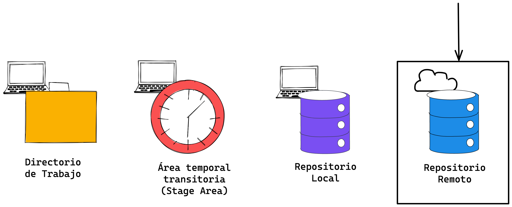
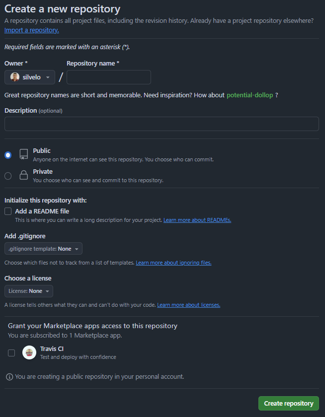
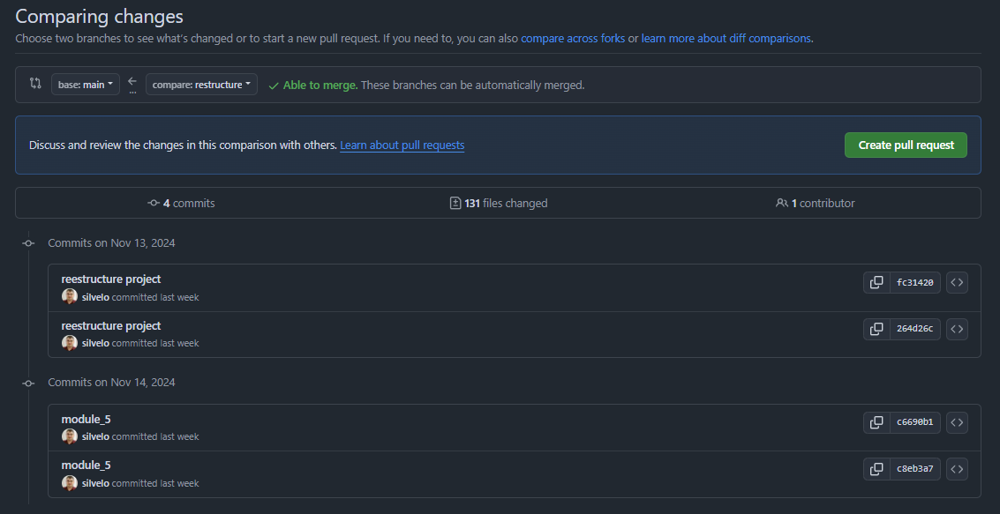
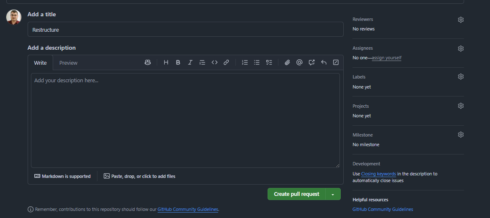
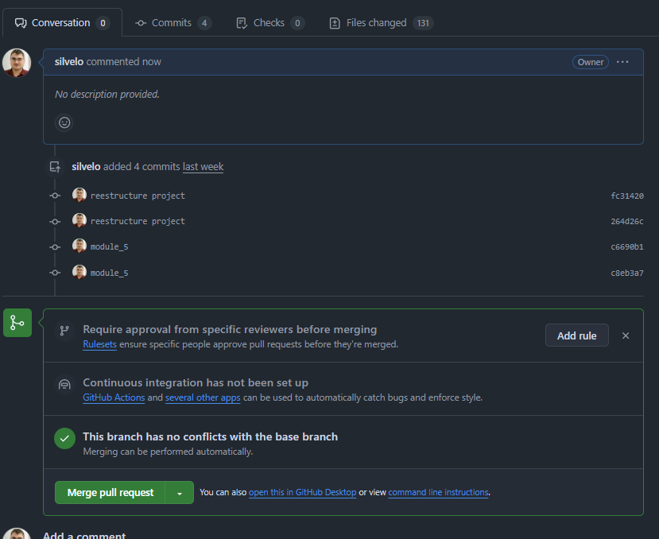

  <!-- _paginate: skip -->

  <div class="front">
    <h1 class="title"> Git Básico </h1>
    <hr class="line"/>
    <p class="author">Arturo Silvelo</p>
    <p class="company">Try New Roads</p>
  </div>

---

# Trabajando de forma remota

---



---

## Creando un repositorio

<div style="display: flex;">
  <div style="flex: 1;">
    
  </div>
  <div style="flex: 1; padding-left: 2em;">
    <ul>
      <li>Dueño del repositorio</li>
      <li>Nombre del repositorio</li>
      <li>Descripción corta</li>
      <li>Visibilidad del repositorio</li>
      <li>Añadir README, gitignore y licencia</li>
    </ul>
  </div>
</div>

---

## Configurando conexión SSH

SSH es un protocolo de comunicación segura que permite a los usuarios de una red conectar a un servidor remoto. Esto nos permite trabajar con repositorios remotos sin necesidad de usar usuario y contraseña cada vez que hagamos una acción.

```bash
ssh-keygen -t ed25519 -C "your_email@example.com"
```

[GitHub SSH Key Generation](https://docs.github.com/en/authentication/connecting-to-github-with-ssh/generating-a-new-ssh-key-and-adding-it-to-the-ssh-agent)

---

## Clonando un repositorio ya creado

Para clonar un repositorio que ya ha sido creado, puedes utilizar el siguiente comando:

```bash
git clone <URL-del-repositorio>
```

Existen dos formas principales de clonar un repositorio:

- **Usando SSH**: Requiere una clave SSH configurada en tu equipo.

  ```bash
  git clone git@github.com:user/repository.git
  ```

- **Usando HTTPS**: Requiere ingresar tus credenciales (usuario y contraseña) cada vez que interactúas con el repositorio.

  ```bash
  git clone https://github.com/user/repository.git
  ```

Al clonar un repositorio, Git crea automáticamente una carpeta con el mismo nombre que el repositorio remoto.

Si deseas especificar un nombre diferente para la carpeta local, puedes hacerlo de la siguiente manera:

```bash
git clone <URL-del-repositorio> <nombre-de-carpeta>
```

---

## Enlazar repositorio local con uno remoto

Para enlazar un repositorio local con un repositorio remoto, puedes usar el siguiente comando:

```bash
git remote add <alias> <direccion>
```

Donde:

- **alias** es el nombre que se le asignará al repositorio remoto, por ejemplo `origin`.
- **direccion** es la URL del repositorio remoto (puede ser SSH o HTTPS).

Para comprobar los repositorios remotos configurados, usa:

```bash
git remote -v
```

Este comando te mostrará las direcciones URL de los remotos configurados para el repositorio local.

---

## Traer cambios remotos al repositorio local

Para traer cambios desde un repositorio remoto, usa los siguientes comandos:

- **git fetch**: Descarga los cambios, pero no los integra en tu rama actual.

  ```bash
  git fetch <alias>
  ```

- **git pull**: Descarga y fusiona los cambios del remoto en tu rama actual.

  ```bash
  git pull <alias> <branch>
  ```

Usa `git fetch` para revisar cambios antes de integrarlos, y `git pull` para aplicarlos directamente.

---

## Escribiendo en el repositorio remoto

Para subir tus cambios locales al repositorio remoto, utiliza el siguiente comando:

```bash
git push <alias> <branch>
```

- **<alias>**: Es el nombre del repositorio remoto (por ejemplo, origin).
- **<branch>**: Es la rama local que deseas subir al repositorio remoto.

A veces, puedes encontrar problemas al intentar hacer `git push` si tu rama local está por detrás de la rama remota. En este caso, necesitarás hacer un `git pull` primero para actualizar tu rama local antes de poder hacer el `push`.

---

## Crear ramas en remoto

Para crear una rama en remoto, primero debes crearla en tu entorno local y luego enviarla al repositorio remoto:

- Crea la rama en local con:

  ```bash
  git switch -c my-branch
  ```

- Envía la rama al remoto con:

  ```bash
  git push origin my-branch
  ```

Esto crea la rama en el repositorio remoto y la vincula con tu rama local.

---

## Fusionar ramas

Para fusionar ramas, tenemos dos opciones:

- **De forma local**:

  ```bash
  # Primero, cambia a la rama de destino
  git switch main
  # Luego, fusiona los cambios de la rama de origen
  git merge my-branch
  # Por último, sube los cambios al repositorio remoto:
  git push origin main
  ```

- **Mediante una Pull Request**:

  Esta opción es útil cuando trabajamos en equipos de desarrollo, ya que otra persona revisará los cambios antes de integrarlos. Para ello, primero subimos nuestra rama al repositorio remoto:

  ```bash
  git push origin my-branch
  ```

---

## Como crear una PR

<div style="display: flex;">
  <div style="flex: 1;">
    
    
  </div>
  <div style="flex: 1; padding-left: 2em;">
    <ol>
      <li><small>Asegúrate de haber subido tu rama al repositorio remoto con el comando:</small>
        <pre><code>git push origin my-branch</code></pre>
      </li>
      <li><small>Accede repositorio en GitHub.</small></li>
      <li><small>En la pestaña "Pull Requests", haz clic en "New Pull Request".</small></li>
      <li><small>Selecciona la rama base y la rama con los cambios que quieres fusionar.</small></li>
      <li><small>Agrega una descripción y, si es necesario, asigna revisores.</small></li>
      <li><small>Haz clic en "Create Pull Request" para finalizar.</small></li>
    </ol>
  </div>
</div>

---

## Merge PR

<div style="display: flex;">
  <div style="flex: 1;">
    
  </div>
  <div style="flex: 1; padding-left: 2em;">
    Una vez creada y esté preparada para ser integrada, la persona encargada de revisar los cambios puede confirmar el merge.
  </div>
</div>

---

## Fork

Un **fork** es una copia personal de un repositorio que se encuentra en un repositorio remoto. Se utiliza principalmente cuando deseas realizar cambios en un proyecto de otra persona sin afectar el repositorio original.

Algunos motivos para usar un fork son:

- El proyecto original ha sido abandonado.
- El proyecto original no acepta nuestros cambios.
- No tenemos permisos para enviar código al proyecto original.

---

## Sincronizar cambios de un fork

Para sincronizar tu fork con el proyecto original (upstream), primero debes agregar el repositorio original como un "remote" adicional.

Usa el siguiente comando para añadir el repositorio original como un remoto llamado `upstream`:

```bash
git remote add upstream <url_proyecto>
```

Ahora tendrás dos remotos configurados:

- **origin**: Apunta a tu fork, donde realizas tus cambios.
- **upstream**: Apunta al repositorio original, desde donde puedes obtener las actualizaciones.

Para sincronizar con el repositorio original, utiliza:

```bash
git pull upstream main
```

Para sincronizar con tu fork, utiliza:

```bash
git pull origin main
```
