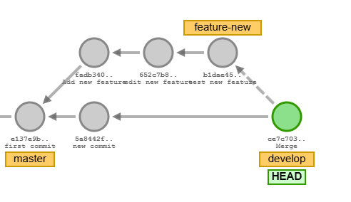
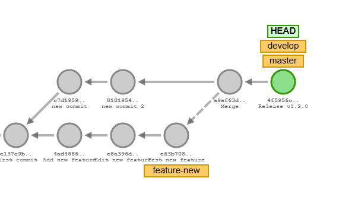
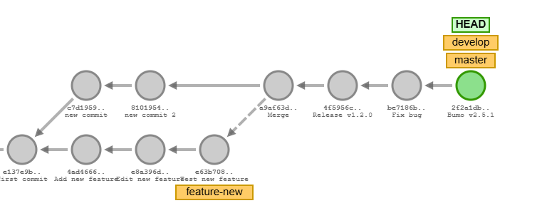
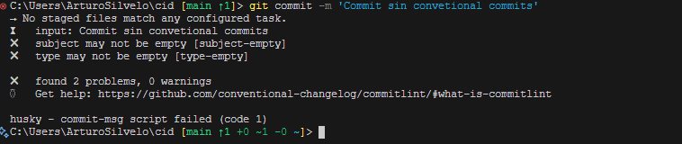

  <!-- _paginate: skip -->

  <div class="front">
    <h1 class="title"> Git Básico </h1>
    <hr class="line"/>
    <p class="author">Arturo Silvelo</p>
    <p class="company">Try New Roads</p>
  </div>

---

# Buenas Prácticas

---

## Flujos de trabajo

Todas las estrategias de flujo de trabajo en Git se basan esencialmente en cómo se crean y fusionan las ramas con la principal.  
No hay una estrategia universalmente mejor, simplemente cada proyecto define la que mejor se adapta a sus necesidades.

**Principales flujos de trabajo:**

- **Git Flow**: Estructura ramificada con ramas de desarrollo, producción y soporte.
- **GitHub Flow**: Enfoque simple y lineal adecuado para despliegues continuos.
- **Trunk Based**: Ramas cortas que se fusionan rápidamente a la principal.
- **Ship/Show/Ask**: Flujo basado en revisiones y ciclos de retroalimentación antes de fusionar.

---

## Git Flow

**Git Flow** es una estrategia de ramificación que organiza el trabajo en dos ramas principales y ramas de apoyo temporales.

**Ramas principales:**

- **main**: Contiene el código en producción.
- **develop**: Almacena los últimos cambios en desarrollo. Cuando está lista y estable, sus cambios se fusionan en **main**.

**Ramas de apoyo:** (temporales, se eliminan tras fusionar)

- **Feature**: Para desarrollar nuevas funcionalidades.
- **Release**: Para preparar versiones listas para producción.
- **Hotfix**: Para corregir errores en producción.

---

## Ramas de apoyo en Git Flow

| Rama    | Desde dónde se crea | A dónde se fusiona | Convención de nombre |
| ------- | ------------------- | ------------------ | -------------------- |
| Feature | `develop`           | `develop`          | `feature-*`          |
| Release | `develop`           | `main` y `develop` | `release-*`          |
| Hotfix  | `main`              | `main` y `develop` | `hotfix-*`           |

---

## Feature

<div style="display: flex; align-items: flex-start;">
  <div style="flex: 1;">
    
  </div>
  <div style="flex: 1;">

```bash
# Creamos la nueva rama desde develop
git switch -c feature-new develop
# Hacemos los cambios necesarios
# Volvemos a develop y fusionamos las ramas
git switch develop
git merge --no-ff feature-new
# Eliminamos la rama
git branch -d feature-new
```

El flag `--no-ff` es opcional, pero genera siempre un commit al fusionar. Esto deja un commit en el historial que contiene todos los cambios de la rama, haciendo más sencillo seguir el flujo de trabajo.

  </div>
</div>

---

## Release

<div style="display: flex; align-items: flex-start;">
  <div style="flex: 1;">
    
  </div>
  <div style="flex: 1;">

```bash
# Crear una nueva rama de release desde develop
git checkout -b release-1.2.0 develop
# Actualizar archivos para reflejar el cambio de versión
git commit -am 'Release v1.2.0'
# Cambiar a la rama main para fusionar los cambios
git switch main
# Fusionar la rama de release con un commit dedicado
git merge --no-ff release-1.2.0
# Cambiar a la rama develop para sincronizarla
git switch develop
# Fusionar los cambios de la rama de release en develop
git merge --no-ff release-1.2.0
# Eliminar la rama de release porque ya no es necesaria
git branch -d release-1.2.0
```

  </div>
</div>

---

## Hotfix

<div style="display: flex; align-items: flex-start;">
  <div style="flex: 1;">
    
  </div>
  <div style="flex: 1;">

```bash
# Crear una nueva rama hotfix desde main
git switch -c hotfix-2.5.1 main
# Corregir el bug y registrar los cambios en un commit
git commit -am 'Fix bug'
# Actualizar archivos para reflejar el cambio de versión
git commit -am 'bump version 2.5.1'
# Cambiar a la rama main para fusionar los cambios del hotfix
git switch main
# Fusionar la rama hotfix en main con un commit dedicado
git merge --no-ff hotfix-2.5.1
# Hacer lo mismo en develop
git switch develop
git merge --no-ff hotfix-2.5.1
# Borrar la rama
git branch -d hotfix-2.5.1
```

  </div>
</div>

---

## GitHub Flow

GitHub Flow se basa en la creación de **Pull Requests**, que serán revisadas y discutidas antes de ser integradas en la rama principal (`main`). Es una estrategia ideal para proyectos de código abierto, ya que cualquier persona puede proponer cambios que serán aceptados o rechazados tras revisión.

**Tipos de ramas:**

- `main`: La rama principal, estable y lista para producción.
- Otras ramas: Creadas temporalmente para implementar cambios y luego integrarse en `main`.

---

## Trunk Based

Trunk Based Development se basa en el trabajo directo sobre la rama principal (`main` o `trunk`). Los desarrolladores crean ramas temporales de corta duración, que integran frecuentemente en la rama principal para evitar conflictos grandes.

**Características principales:**

- `main` o `trunk`: La rama principal y siempre estable.
- Las ramas de características son de corta duración, idealmente no más de un día o unas pocas horas.
- Integración continua: Se integran cambios frecuentemente en la rama principal.

---

## Ship/Show/Ask

Ship/Show/Ask es un enfoque de desarrollo ágil que se enfoca en lanzar cambios de manera continua y rápida para obtener retroalimentación temprana de los usuarios.

**Pasos del flujo de trabajo:**

- **Ship**: Desarrollar y lanzar el cambio rápidamente.
- **Show**: Usamos pull requests para integrar cambios, pero no esperamos revisiones manuales. En lugar de eso, esperamos a que los tests automatizados pasen las pruebas para garantizar que los cambios no rompan el sistema.
- **Ask**: Solicitar retroalimentación para evaluar el impacto y mejorar el producto.

Este flujo de trabajo es ideal para equipos que necesitan entregar características rápidamente y ajustar según el feedback del usuario.

---

# Gestionar Repositorio

---

## Conventional Commits

**Conventional Commits** es una especificación para escribir mensajes de commit que sigan un formato consistente y semántico, facilitando la comprensión y automatización en los flujos de trabajo.

**Formato básico:**

```bash
<tipo>(<área opcional>): <descripción breve>

<cuerpo opcional>

<footer opcional>
```

---

## Hooks en Git

Los **Git Hooks** son scripts que se ejecutan automáticamente en respuesta a eventos específicos de Git, como:

- `pre-commit`: Antes de que se cree un commit.
- `pre-push`: Antes de enviar cambios al repositorio remoto.
- `commit-msg`: Al escribir el mensaje del commit.

**¿Por qué usar hooks?**

- Garantizar la calidad del código mediante linters o formateadores como `Prettier`.
- Ejecutar tests automáticamente para evitar errores en el código.
- Asegurar convenciones de estilo, como **Conventional Commits**.

Los hooks permiten automatizar tareas clave y mejorar la colaboración en equipos.

---

## Angular Preset

**Tipos más comunes:**

- `feat`: Introducción de una nueva funcionalidad.
- `fix`: Corrección de un bug.
- `docs`: Cambios en la documentación.
- `style`: Cambios de formato (espacios, comas, etc.).
- `refactor`: Cambios en el código que no corrigen bugs ni agregan funcionalidades.
- `test`: Adición o modificación de tests.
- `chore`: Cambios en tareas de construcción o herramientas.

Este enfoque ayuda a generar automáticamente changelogs y facilita el entendimiento del historial del proyecto.

[Conventional Commits](https://www.conventionalcommits.org/en/v1.0.0/)

---

## Hooks en Git

Los **Git Hooks** son scripts que se ejecutan automáticamente en respuesta a eventos específicos de Git, como:

- `pre-commit`: Antes de que se cree un commit.
- `pre-push`: Antes de enviar cambios al repositorio remoto.
- `commit-msg`: Al escribir el mensaje del commit.

**¿Por qué usar hooks?**

- Garantizar la calidad del código mediante linters o formateadores como `Prettier`.
- Ejecutar tests automáticamente para evitar errores en el código.
- Asegurar convenciones de estilo, como **Conventional Commits**.

Los hooks permiten automatizar tareas clave y mejorar la colaboración en equipos.

---

## Usando Husky para gestionar hooks

**Husky** es una herramienta que simplifica la configuración y gestión de hooks en proyectos Git.

**Configuración básica de Husky:**

```bash
# Instalar Husky
npm install husky --save-dev

# Habilitar hooks en el proyecto
npx husky install

# Crear un hook para ejecutar linters antes de un commit
npx husky add .husky/pre-commit "npm run lint"

# Crear un hook para validar mensajes de commits
npx husky add .husky/commit-msg "npx commitlint --edit $1"
```

Con Husky, puedes garantizar que los linters, tests y convenciones de commits se ejecuten automáticamente.

---

## Configurando nuestro repositorio

Para empezar a configurar un nuevo proyecto en **Node.js** y establecer buenas prácticas de desarrollo, sigue estos pasos:

- Inicializa un nuevo proyecto con `npm`:

```bash
npm init
```

- Instala **ESLint** para analizar el código y asegurarte de que sigue las mejores prácticas:

```bash
npm install eslint --save-dev
```

- Instala **Prettier** para formatear el código de forma consistente:

```bash
npm install prettier --save-dev
```

- Configura **Commitlint** para asegurar que los mensajes de los commits siguen un estándar:

```bash
npm install @commitlint/{config-conventional,cli} --save-dev
```

---

> Para proyectos en **Python**, considera usar **pycodestyle** como linter y **autopep8** como formatter.

---

## Configurando nuestro repositorio (Continuación)

- Instala **lint-staged** para ejecutar linters en los archivos modificados antes de hacer un commit:

```bash
npm install --save-dev lint-staged
```

- Instala **Husky** para añadir _git hooks_ y automatizar tareas, como ejecutar linters antes de cada commit:

```bash
npm install husky --save-dev
```

- Instala **semantic-release** para gestionar el versionado semántico de tu proyecto:

```bash
npm install --save-dev semantic-release
npm install --save-dev @semantic-release/changelog @semantic-release/commit-analyzer @semantic-release/git @semantic-release/github @semantic-release/npm @semantic-release/release-notes-generator
```

Estos pasos ayudan a mantener un código limpio y fácil de mantener.

---

## Configurando las herramientas

Una vez instaladas las dependencias, es necesario configurarlas para integrarlas correctamente en nuestro proyecto:

- Configurar **ESLint**:

```bash
npx eslint --init
```

Esto generará un archivo `.eslintrc.json` con la configuración básica.

- Configurar **Prettier**:

```bash
echo {} > .prettierrc
```

- Configurar **lint-staged**:

```bash
echo {} > .lintstagedrc
```

- Configurar **Husky** para usar los hooks:

```bash
npx husky init
```

---

## Configurando las herramientas

- Crea un archivo de configuración `commitlint.config.js` en la raíz del proyecto:

```javascript
echo "export default { extends: ['@commitlint/config-conventional'] };" > commitlint.config.js
```

- Integra **Commitlint** con **Husky** para que valide automáticamente los mensajes de commit:

```bash
npx husky add .husky/commit-msg 'npx --no-install commitlint --edit "$1"'
```

---



---

- Para personalizar el comportamiento de `standard-version`, crea un archivo `.releaserc.json` en la raíz de tu proyecto.

- Aquí tienes un ejemplo básico de configuración:

```json
{
  "branches": ["main"],
  "plugins": [
    "@semantic-release/commit-analyzer",
    "@semantic-release/release-notes-generator",
    "@semantic-release/changelog",
    "@semantic-release/git",
    "@semantic-release/github"
  ]
}
```

- En este archivo, puedes configurar:
  - `branches`: las ramas en las que se va a gestionar el versionado.
  - `plugins`: los plugins que manejarán el análisis de commits, generación de changelog, gestión de tags, etc.

---

## Configurando acciones en GitHub

- Las **GitHub Actions** te permiten automatizar tareas como la ejecución de tests, linters y despliegues dentro de tu flujo de trabajo en GitHub.

- Para configurarlas, crea un archivo `.github/workflows/ci.yml` en tu repositorio.

- Aquí tienes un ejemplo básico de configuración para un flujo de trabajo que ejecuta linting y tests en cada push a la rama `main`:

- Este archivo define un flujo de trabajo que se ejecuta cuando hay un `push` a la rama `main`, instala las dependencias del proyecto, ejecuta el linter y luego corre los tests.

---

```yaml
name: CI
on:
  push:
    branches:
      - main
jobs:
  lint-and-test:
    runs-on: ubuntu-latest
    steps:
      - name: Checkout code
        uses: actions/checkout@v2
      - name: Set up Node.js
        uses: actions/setup-node@v2
        with:
          node-version: "14"
      - name: Install dependencies
        run: npm install
      - name: Lint code
        run: npm run lint
      - name: Run tests
        run: npm test
```
