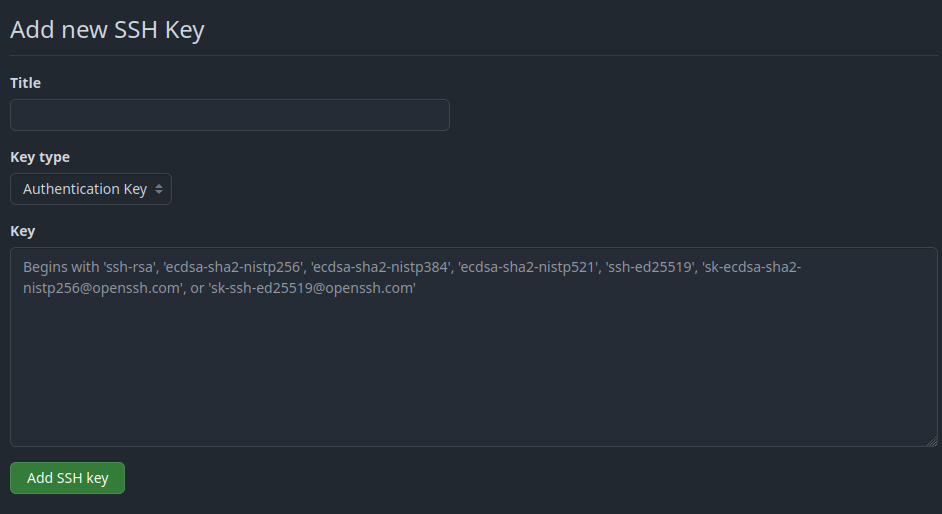

  <!-- _paginate: skip -->

  <div class="front">
    <h1 class="title"> Git Básico </h1>
    <hr class="line"/>
    <p class="author">Arturo Silvelo</p>
    <p class="company">Try New Roads</p>
  </div>

---

# Trabajando de Forma Remota

---

<div class=container-image>
  
</div>


---

## Configuración en GitHub

---

### Creando una clase SSH


1. **Generar clave SSH**
```bash
ssh-keygen -t ed25519 -C "tu-email@ejemplo.com"
```

2. **Copiar la clave pública**
```bash
cat ~/.ssh/id_ed25519.pub
```

3. **Agregar en GitHub**: Settings → SSH and GPG keys → New SSH key

---

<div class=container-image-col>

<div class=image-col>
  
</div>
<div class=image-col>
  
</div>

</div>

---


## ¿Qué es SSH?


**SSH (Secure Shell)** es un protocolo de red seguro que permite establecer una comunicación encriptada entre cliente y servidor. Proporciona autenticación mediante verificación de identidad sin necesidad de contraseñas repetitivas, protegiendo todos los datos durante la transmisión y garantizando la seguridad de las conexiones remotas.

---

## ¿Por qué usar SSH con Git?

- **Sin contraseñas repetitivas**: Una vez configurado, no pide credenciales
- **Mayor seguridad**: Autenticación por criptografía de clave pública
- **Mejor para automatización**: Scripts y CI/CD sin problemas de autenticación
- **Recomendado por GitHub**: Método preferido para desarrolladores

---

## Cómo funciona SSH

- **Clave Privada** → Se queda en tu computadora (secreta)
- **Clave Pública** → Se sube a GitHub (se puede compartir)
- **Autenticación** → GitHub verifica que tienes la clave privada
- **Conexión Segura** → Comunicación cifrada establecida

---

## Crear un Repositorio 

---

### Crear repositorio en Github

1. **Nuevo repositorio**: Click en "New repository" o el botón "+"
2. **Nombre**: Elegir nombre descriptivo para el proyecto
3. **Descripción**: Breve explicación del propósito del repositorio
4. **Visibilidad**: Seleccionar Public (público) o Private (privado)
5. **Inicialización**: Opcionalmente agregar README.md, .gitignore o licencia

---

<div class=container-image>
  
</div>

---

## Clonar un Repositorio

---

### Desde GitHub a local

Para clonar un repositorio que ya ha sido creado:

- Usando SSH

    ```bash
    git clone git@github.com:usuario/repositorio.git
    ```

- Usando HTTPS

    ```bash
    git clone https://github.com/usuario/repositorio.git
    ```
---

Al clonar un repositorio `git` crea una carpeta con el mismo nombre del repositorio.

Para especificar un nombre diferente para la carpeta local:

```bash
git clone git@github.com:usuario/repositorio.git mi-carpeta
```

---

## Enlazar un Repositorio Local

Si tenemos un repositorio local y lo queremos enlazar a uno remoto:

```bash
git remote add origin git@github.com:usuario/repositorio.git
```

---

**¿Qué es `origin`?**
- Es un **nombre o alias** que le damos al repositorio remoto
- Por **convención** se usa "origin" para el repositorio principal
- Puedes usar cualquier nombre: `upstream`, `backup`, `produccion`, etc.

**¿Qué es la dirección?**
- Es la **URL** donde está alojado el repositorio remoto
- Formato SSH: `git@github.com:usuario/repositorio.git`
- Formato HTTPS: `https://github.com/usuario/repositorio.git`

---

### Verificar remotos configurados

Para verificar los repositorios configurados

```bash
git remote -v
```

**Salida típica:**
```
origin  git@github.com:usuario/repositorio.git (fetch)
origin  git@github.com:usuario/repositorio.git (push)
```

---

## Trabajar con Cambios

---


### Subir cambios al remoto


- **Primera vez (establecer tracking):**
    
    ```bash
    git push -u origin main
    # Rama local 'main' → Rama remota 'main'
    ```

- **Primera vez nombres distintos:**
    
    ```bash
    git push -u origin mi-rama:rama-remota
    # Rama local 'mi-rama' → Rama remota 'rama-remota'
    ```

- **Después, simplemente:**

    ```bash
    git push
    ```

---


### ¿Por qué `-u` la primera vez?

El parámetro `-u` (o `--set-upstream`) establece una **relación de seguimiento** entre tu rama local y la rama remota.

**Sin `-u`:**
- Tienes que especificar siempre: `git push origin main`
- Git no sabe a dónde hacer push por defecto

**Con `-u`:**
- Git "recuerda" la rama remota
- Puedes usar solo `git push` en el futuro

---


### Estados del tracking

- **Rama sin tracking:**

    ```bash
    git push origin main  # Siempre necesario especificar
    ```

- **Rama con tracking establecido:**

    ```bash
    git push  # Git sabe a dónde enviar
    ```
----

- **Ver estado de tracking:**

    ```bash
    git branch -vv
    ```

- **Salida ejemplo:**
    ```
    * main    a1b2c3d [origin/main] Último commit
    feature f4e5d6c [origin/desarrollo: ahead 2] Commits pendientes
    local   g7h8i9j Sin tracking configurado
    ```

- **Interpretación:**
    - `main` vinculada con `origin/main`
    - `feature` vinculada con `origin/desarrollo` (2 commits por subir)
    - `local` sin vinculación remota

---

## Traer Cambios del Remoto


---

### Git Fetch - Solo descargar

```bash
git fetch origin
```

**¿Qué hace?**
- Descarga cambios del repositorio remoto
- **NO modifica** tu trabajo local
- Actualiza las referencias remotas (`origin/main`, `origin/develop`)
- Te permite revisar antes de fusionar

---


### Git Pull - Descargar y fusionar

```bash
git pull origin main
```

**¿Qué hace?**
- Hace `git fetch` + `git merge` automáticamente
- Descarga cambios Y los fusiona en tu rama actual
- Más rápido pero menos control
- Puede crear conflictos inmediatamente

---


### ¿Cuándo usar cada uno?

- **Usar Git Fetch cuando:**
    - Quieres revisar los cambios antes de fusionar
    - Trabajas en equipo y necesitas ser cauteloso
    - Quieres evitar conflictos inesperados
    - Necesitas comparar cambios primero

- **Usar Git Pull cuando:**
    - Confías en los cambios remotos
    - Trabajas solo en la rama
    - Quieres sincronizar rápidamente
    - No hay riesgo de conflictos importantes

---

### Resolver conflictos en Pull

Si hay conflictos al hacer `git pull`:

1. **Git marca los archivos con conflictos**
```
<<<<<<< HEAD
Tu código local
=======
Código del remoto  
>>>>>>> origin/main
```

---

2. **Editar y resolver conflictos manualmente**

3. **Agregar archivos resueltos**
```bash
git add archivo-resuelto.txt
```

4. **Completar el merge**
```bash
git commit
```

---

## Ramas en Remoto

---


### Crear y subir nueva rama

- **Crear rama local (opción tradicional):**

    ```bash
    git checkout -b feature/nueva-funcionalidad
    ```

- **Crear rama local (opción moderna):**

    ```bash
    git switch -c feature/nueva-funcionalidad
    ```
---

- **Primera subida con tracking:**
    
    ```bash
    git push -u origin feature/nueva-funcionalidad
    ```

- **Siguientes pushes:**

    ```bash
    git push  # Ya no necesita especificar origin ni rama
    ```

---

### Trabajar con ramas remotas existentes

- **Con checkout (tradicional):**
    
    ```bash
    git checkout -b feature/login origin/feature/login
    ```

- **Con switch (moderno):**

    ```bash
    git switch -c feature/login origin/feature/login
    ```

- **O más simple (Git moderno):**

    ```bash
    git switch feature/login
    # Git automáticamente crea tracking con origin/feature/login
    ```

---

### Eliminar Ramas Remotas


- **Eliminar rama remota:**

    ```bash
    git push origin --delete feature/rama-antigua
    ```

- **O usando sintaxis corta:**

    ```bash
    git push origin :feature/rama-antigua
    ```

---

### Fusionar Ramas


- **Cambiar a rama destino:**

    ```bash
    git switch main
    ```

- **Fusionar rama de feature:**

    ```bash
    git merge feature/nueva-funcionalidad
    ```

- **Subir cambios fusionados:**

    ```bash
    git push origin main
    ```

---

## Pull Request

---

### ¿Qué es un Pull Request?

Un **Pull Request (PR)** es una solicitud para fusionar cambios de una rama a otra, típicamente desde una rama de feature hacia la rama principal.

**Propósito:**
- Solicitar fusión de cambios
- Permitir revisión de código por el equipo
- Facilitar discusión sobre los cambios
- Mantener historial de decisiones

---

### ¿Por qué usar Pull Requests?

- **Revisión de código**: Otros desarrolladores revisan antes de fusionar
- **Control de calidad**: Evita que código problemático llegue a main
- **Discusión**: Comentarios y sugerencias en línea
- **Historial**: Registro de qué cambios se hicieron y por qué
- **Tests automáticos**: CI/CD puede ejecutar pruebas antes del merge

---


## Flujo básico de Pull Request

1. **Crear rama de feature**
2. **Hacer commits con cambios**
3. **Push de la rama al remoto**
4. **Crear Pull Request en GitHub**
5. **Revisión y discusión**
6. **Merge a rama principal**
7. **Limpieza (eliminar rama)**

---

### 1. Crear rama de feature

```bash
git checkout main
git pull origin main
git checkout -b feature/login-usuario
```

**Buenas prácticas:**
- Partir siempre de la rama principal actualizada
- Nombres descriptivos: `feature/`, `bugfix/`, `hotfix/`
- Una funcionalidad por rama

---

### 2. Hacer commits

```bash
# Trabajar en la funcionalidad
git add .
git commit -m "Agregar formulario de login"

git add .
git commit -m "Validar datos de usuario"

git add .
git commit -m "Integrar autenticación JWT"
```

**Consejos:**
- Commits pequeños y específicos
- Mensajes descriptivos
- Funcionalidad completa y probada

---


### 3. Push al remoto

```bash
git push -u origin feature/login-usuario
```

**Primera vez:** Usar `-u` para establecer tracking

**Siguientes pushes:**
```bash
git push
```

---

### 4. Crear PR en GitHub

1. **GitHub detecta la nueva rama** y sugiere crear PR
2. **O manual**: "New pull request" → Seleccionar ramas
3. **Completar información**:
   - Título descriptivo
   - Descripción detallada
   - Reviewers (revisores)
   - Labels, Assignees, etc.

---

### 5. Revisión y discusión

**Los revisores pueden:**
- Comentar líneas específicas del código
- Sugerir cambios
- Aprobar o rechazar
- Solicitar modificaciones

**El autor puede:**
- Responder comentarios
- Hacer commits adicionales
- Resolver discusiones

---

### 6. Merge del Pull Request

**Opciones de merge en GitHub:**

- **Merge commit**: Crea commit de merge (preserva historial)
- **Squash and merge**: Combina todos los commits en uno
- **Rebase and merge**: Reaplica commits sin merge commit

---


### 7. Limpieza después del merge

```bash
# Cambiar a main y actualizar
git switch main
git pull origin main

# Eliminar rama local
git branch -d feature/login-usuario

# GitHub elimina automáticamente la rama remota
```

---

### Estados de un Pull Request

- **Open**: En proceso, esperando revisión
- **Draft**: Borrador, trabajo en progreso
- **Ready for review**: Listo para revisión
- **Changes requested**: Necesita modificaciones
- **Approved**: Aprobado, listo para merge
- **Merged**: Fusionado exitosamente
- **Closed**: Cerrado sin fusionar


---

### Template para descripción de PR

```markdown
## ¿Qué hace este PR?
Breve descripción de los cambios

## ¿Por qué es necesario?
Contexto y justificación

## ¿Cómo probarlo?
Pasos para verificar la funcionalidad

## Checklist
- [ ] Tests actualizados
- [ ] Documentación actualizada
- [ ] Sin conflictos con main
- [ ] Probado localmente
```

---