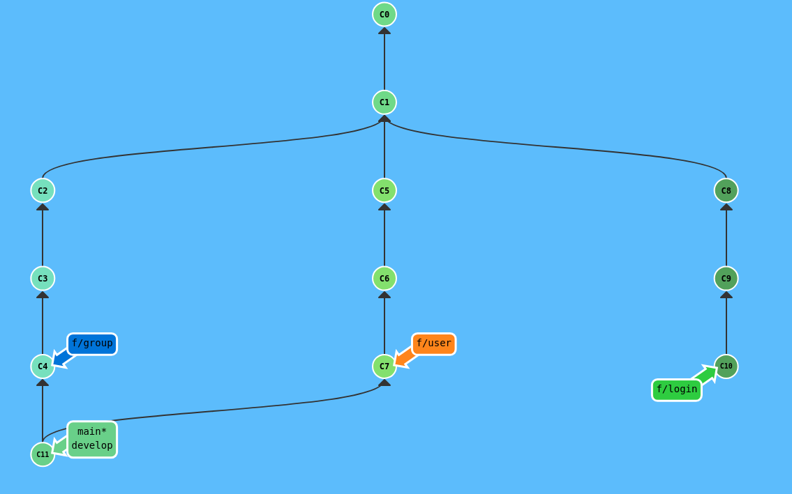
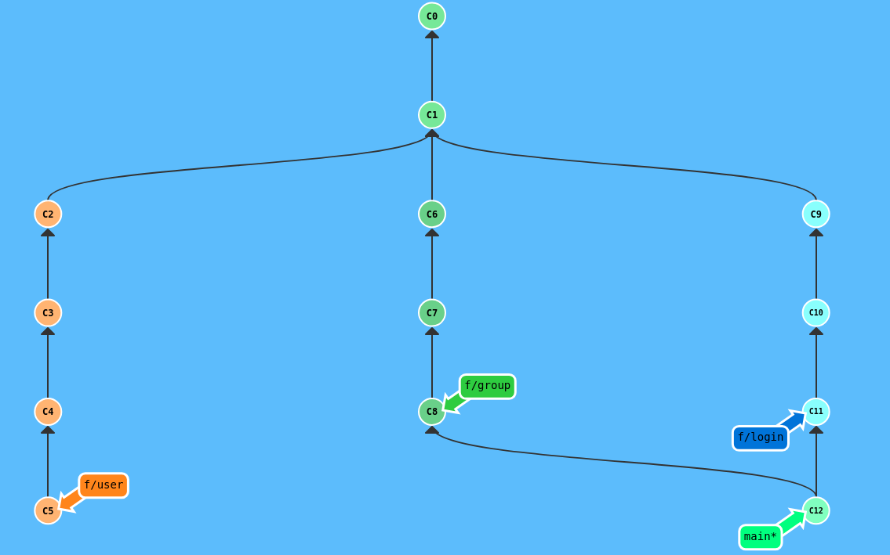
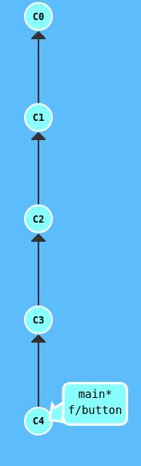
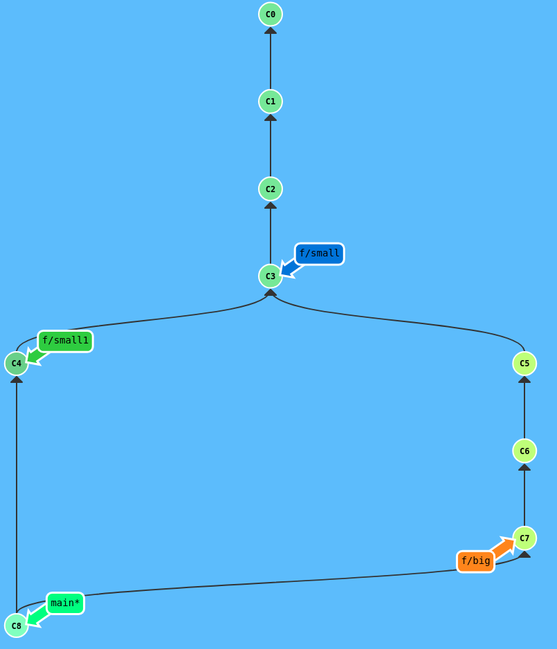

  <!-- _paginate: skip -->

  <div class="front">
    <h1 class="title"> Git Básico </h1>
    <hr class="line"/>
    <p class="author">Arturo Silvelo</p>
    <p class="company">Try New Roads</p>
  </div>


---

# Buenas Prácticas

---

## Tags y Releases

---

### ¿Qué son los Tags?

Los **tags** son etiquetas que marcan puntos específicos en el historial de Git, típicamente para versiones.

**Características:**
- **Inmutables**: Una vez creados, no cambian
- **Referencias fijas**: Apuntan a un commit específico
- **Versionado**: Marcan releases (v1.0, v2.1, etc.)
- **Navegación**: Fácil acceso a versiones anteriores

---

### Tipos de Tags

**Lightweight tags** (etiquetas ligeras):
```bash
git tag v1.0.0
```

**Annotated tags** (etiquetas anotadas):
```bash
git tag -a v1.0.0 -m "Release version 1.0.0"
```

**Diferencias:**
- Lightweight: Solo un puntero al commit
- Annotated: Incluye metadata (autor, fecha, mensaje)

---

### Crear Tags

**Tag en el commit actual:**
```bash
git tag v1.0.0
git tag -a v1.0.0 -m "First stable release"
```

**Tag en commit específico:**
```bash
git tag v0.9.0 abc1234
git tag -a v0.9.0 abc1234 -m "Beta release"
```

**Ver información del tag:**
```bash
git show v1.0.0
```

---

### Gestionar Tags

**Listar tags:**
```bash
git tag                    # Todos los tags
git tag -l "v1.*"         # Tags que coincidan con patrón
git tag --sort=-version:refname  # Ordenados por versión
```

**Eliminar tags:**
```bash
git tag -d v1.0.0         # Local
git push origin --delete tag v1.0.0  # Remoto
```

---

### Subir Tags al Remoto

**Un tag específico:**
```bash
git push origin v1.0.0
```

**Todos los tags:**
```bash
git push origin --tags
```

**Push con tags automáticamente:**
```bash
git push --follow-tags
```

---

### Semantic Versioning (SemVer)

**Formato:** `MAJOR.MINOR.PATCH`

- **MAJOR** (1.x.x): Cambios incompatibles
- **MINOR** (x.1.x): Nuevas funcionalidades compatibles  
- **PATCH** (x.x.1): Correcciones de errores

**Ejemplos:**
```bash
git tag v1.0.0    # Primera versión estable
git tag v1.1.0    # Nueva funcionalidad
git tag v1.1.1    # Corrección de bugs
git tag v2.0.0    # Breaking changes
```

---

### Checkout a Tags

**Ver código de una versión específica:**
```bash
git switch --detach v1.0.0
```

**Crear rama desde tag:**
```bash
git switch -c hotfix-v1.0.0 v1.0.0
```

**Volver a la rama actual:**
```bash
git checkout main
```

---

## Releases en GitHub

---

### ¿Qué son los Releases?

Los **releases** en GitHub son versiones empaquetadas de tu software basadas en tags.

**Incluyen:**
- **Tag asociado**: Versión específica del código
- **Notas de release**: Descripción de cambios
- **Assets**: Archivos binarios, documentación
- **Changelog**: Lista de cambios desde la versión anterior

---

### Crear Release en GitHub

1. **Ir a la pestaña Releases** del repositorio
2. **"Create a new release"**
3. **Seleccionar tag** (o crear uno nuevo)
4. **Título del release**: v1.0.0 - Primera versión estable
5. **Descripción**: Cambios, mejoras, correcciones
6. **Assets**: Subir archivos (opcional)
7. **Publish release**

---

### Release Notes - Ejemplo

```markdown
# Release v1.2.0 - New Authentication System

## 🚀 New Features
- User authentication with JWT tokens
- Password reset functionality

## 🐛 Bug Fixes  
- Fixed login form validation
- Resolved memory leak in user sessions
- Corrected timezone handling

## 🔧 Technical Changes
- Upgraded React to v18
- Improved database performance

## ⚠️ Breaking Changes
- API endpoints now require authentication
- Changed user object structure
```

---

### Flujo completo de Release

```bash
# 1. Finalizar desarrollo
git checkout main
git pull origin main

# 2. Crear tag anotado
git tag -a v1.2.0 -m "Release version 1.2.0"

# 3. Subir tag
git push origin v1.2.0

# 4. En GitHub: Crear release desde el tag
# 5. Escribir release notes
# 6. Publicar release
```

---


## Flujos de Trabajo en Git

---

### ¿Por qué necesitamos flujos de trabajo?

Sin un flujo definido, los equipos enfrentan:
- **Conflictos constantes** entre desarrolladores
- **Código inestable** en ramas principales
- **Releases caóticas** sin control
- **Falta de trazabilidad** de cambios


---

Un flujo de trabajo define **cómo y cuándo** se integran los cambios. No hay una estrategia perfecta, simplemente se usa la que mejor se adapte al proyecto:

- Git Flow

- Github flow

- GitLab flow

- Trunk Based

- Shop/Shop/Ask

---


## Git Flow

El flujo más tradicional y estructurado para equipos grandes.

**Ramas principales:**
- `main`: Código en producción (estable)
- `develop`: Rama de desarrollo principal

**Ramas de soporte:**
- `feature/*`: Nuevas funcionalidades
- `release/*`: Preparación de releases
- `hotfix/*`: Correcciones urgentes

---

### Git Flow - Características

**Ventajas:**
- Control total sobre releases
- Historial muy organizado
- Ideal para software con versiones

**Desventajas:**
- Muy complejo para equipos pequeños
- Releases lentos
- Muchas ramas que mantener


---
### Git Flow - Flujo Feature

```bash
# Crear feature desde develop
git switch -c develop
git switch -b feature/login

# Desarrollo y commits
git commit -m "feat: add login form"
git commit -m "feat: add validation"

# Merge a develop
git switch develop
git merge feature/login-usuario
```

---

### [learngitbranching][gitflow]

<div class=container-image>

</div>

---

## GitHub Flow

El flujo más simple y directo para desarrollo continuo.

**Rama principal:**
- `main`: Siempre desplegable y estable

**Ramas de trabajo:**
- `feature/*`: Nuevas funcionalidades
- `bugfix/*`: Corrección de errores
- `hotfix/*`: Correcciones urgentes

**Principio:** Todo sale y entra de `main`

---

### GitHub Flow - Características

**Ventajas:**
- Muy simple de entender y aplicar
- Deploy continuo natural
- Ideal para equipos ágiles
- Menos overhead de gestión

**Desventajas:**
- Requiere CI/CD robusto
- `main` debe estar siempre estable
- No ideal para releases planificados

---

### GitHub Flow - Flujo básico

```bash
# Crear feature desde main
git switch main
git pull origin main
git switch -c feature/user-profile

# Desarrollo
git commit -m "feat: add user profile page"
git push -u origin feature/user-profile

# PR → Review → Merge → Deploy
```

---

### [learngitbranching][githubflow]

<div class=container-image>

</div>

---

## Trunk-based Development

Un tronco principal donde todos integran frecuentemente.

**Rama principal:**
- `main` o `trunk`: Única rama principal

**Ramas de trabajo:**
- Muy cortas (< 1 día) o commits directos
- `hotfix/*`: Solo para correcciones urgentes

**Principio:** Integración continua real

---

### Trunk-based - Características

**Ventajas:**
- Integración continua real
- Sin merge hell
- Deploy frecuente y rápido
- Feedback inmediato

**Desventajas:**
- Requiere desarrolladores senior
- CI/CD muy robusto obligatorio
- Feature flags necesarios
- Tests automáticos críticos

---

### Trunk-based - Flujo básico

```bash
# Actualizar trunk frecuentemente
git switch main
git pull origin main

# Cambios pequeños directos
git commit -m "feat: add button component"
git push origin main

# O ramas ultra-cortas
git switch -c quick-fix
git commit -m "fix: button alignment"
git push origin quick-fix
# PR inmediato → Merge → Delete
```

---

### [learngitbranching][trunkbased]

<div class=container-image>

</div>


---

## Ship/Show/Ask

Estrategia que combina autonomía con colaboración según el tipo de cambio.

- **Ship** 🚢: Cambios que puedes hacer directamente

- **Show** 👁️: Cambios que compartes para feedback

- **Ask** ❓: Cambios que requieren discusión previa

- **Principio:** Balance entre velocidad y control

---

### Ship/Show/Ask - Características

**Ventajas:**
- Autonomía para desarrolladores senior
- Velocidad en cambios menores
- Control en cambios críticos
- Cultura de confianza en el equipo

**Desventajas:**
- Requiere criterio maduro del equipo
- Necesita desarrolladores experimentados
- Puede crear inconsistencias si no hay criterio
- Difícil para equipos nuevos

---

### Ship/Show/Ask - Criterios

---

**Ship (Push directo):**
- Typos en documentación
- Tests adicionales
- Refactoring menor
- Actualizaciones de dependencias

---

**Show (PR sin esperar aprobación):**
- Features pequeñas
- Cambios de UI menores
- Optimizaciones de rendimiento

---

**Ask (PR con revisión obligatoria):**
- Cambios de arquitectura
- APIs públicas
- Features complejas
- Cambios de seguridad

---

### Ship/Show/Ask - Flujo

```bash
# SHIP - Fix documentación
git commit -m "docs: fix typo in README"
git push origin main

# SHOW - Feature pequeña
git switch -c small-feature
git push -u origin small-feature
# Create PR → Optional review → Merge

# ASK - Cambio grande
git switch -c big-change
# Discutir primero → PR → Required review
```

---

### [learngitbranching][ssaflow]

<div class=container-image>

</div>

---

## Git Hooks

---

### ¿Qué son los Git Hooks?

Scripts que se ejecutan automáticamente en ciertos eventos de Git:

- **Pre-commit**: Antes de cada commit
- **Pre-push**: Antes de cada push  
- **Post-commit**: Después de cada commit
- **Pre-receive**: En el servidor antes de recibir push

**Ubicación:** `.git/hooks/`

---

### Tipos de Hooks

**Hooks del lado cliente:**
- `pre-commit`: Validar código antes del commit
- `commit-msg`: Validar mensaje de commit
- `pre-push`: Validar antes de hacer push
- `post-commit`: Acciones después del commit

**Hooks del lado servidor:**
- `pre-receive`: Validar en servidor antes de recibir
- `post-receive`: Acciones después de recibir push

---

### Pre-commit Hook - Ejemplo

```bash
#!/bin/sh
# .git/hooks/pre-commit

# Ejecutar linter
npm run lint
if [ $? -ne 0 ]; then
  echo "❌ Linting failed"
  exit 1
fi

echo "✅ Pre-commit checks passed"
```

---

### Commit-msg Hook - Ejemplo

```bash
#!/bin/sh
# .git/hooks/commit-msg

# Validar formato conventional commits
commit_regex='^(feat|fix|docs|style|refactor|test|chore)(\(.+\))?: .{1,50}'

if ! grep -qE "$commit_regex" "$1"; then
    echo "❌ Invalid commit message format"
    echo "Use: type(scope): description"
    echo "Example: feat(auth): add login validation"
    exit 1
fi

echo "✅ Commit message format is valid"
```

---

### Saltarse Hooks (Emergencias)

```bash
# Saltar pre-commit (emergencias únicamente)
git commit --no-verify -m "hotfix: critical security patch"

# Saltar pre-push
git push --no-verify
```

**⚠️ Usar solo en emergencias reales**

---


### El Problema de los Hooks Nativos

Los hooks en `.git/hooks/` NO se sincronizan:

- La carpeta `.git/` está en `.gitignore` por defecto  
- Cada desarrollador debe instalar hooks manualmente  
- No hay garantía de que el equipo use las mismas validaciones  
- Los hooks pueden estar desactualizados o ausentes  

**Resultado:** Inconsistencias en el equipo y código de mala calidad llegando al servidor.


---

## Soluciones al Problema

---

### Solución 1: CI/CD con GitHub Actions

GitHub Actions es el sistema de **CI/CD nativo de GitHub** que permite ejecutar workflows automáticamente cuando ocurren eventos en el repositorio.

**Eventos que activan Actions:**
- Push a cualquier rama
- Pull Request creado/actualizado
- Release creado
- Issues creados
- Horarios programados (cron)

---

```yaml
# .github/workflows/ci.yml
name: CI Pipeline
on: 
  push:
    branches: [ main, develop ]
  pull_request:
    branches: [ main ]
    
jobs:
  quality-check:
    runs-on: ubuntu-latest
    steps:
    - name: Checkout code
      uses: actions/checkout@v3
      
    - name: Setup Node.js
      uses: actions/setup-node@v3
      with:
        node-version: '18'
        
    - name: Install dependencies
      run: npm install
      
    - name: Run linter
      run: npm run lint
      
    - name: Run tests
      run: npm test
```
---
### Validar mensajes de commit

```yaml
- name: Check commit messages
  run: |
    # Obtener commits del PR
    git fetch origin main
    COMMITS=$(git rev-list origin/main..HEAD)
    
    for commit in $COMMITS; do
      msg=$(git log --format=%B -n 1 $commit)
      if ! echo "$msg" | grep -qE "^(feat|fix|docs|style|refactor|test|chore)(\(.+\))?: .+"; then
        echo "❌ Invalid commit: $commit"
        echo "Message: $msg"
        exit 1
      fi
    done
    echo "✅ All commit messages are valid"
```
---

### Solución 2: Herramientas como Husky

Husky es una herramienta que permite gestionar Git Hooks de manera fácil y compartible entre el equipo.

```bash
# Instalar husky
npm install --save-dev husky

# Configurar husky
npx husky init
```
---

# Bibliografía y Recursos

---

## Libros y Documentación Oficial

**Pro Git (Oficial)**  
Libro oficial de Git, disponible de forma gratuita en múltiples idiomas.  
https://git-scm.com/book/en/v2

**Aprendiendo Git**  
¡Domina y comprende Git de una vez por todas! Un recurso práctico y completo para entender y dominar Git.  
https://leanpub.com/aprendiendo-git

**Git Documentation**  
Documentación oficial completa de todos los comandos de Git.  
https://git-scm.com/docs

---

## Recursos Interactivos

**Learn Git Branching**  
Herramienta visual e interactiva para aprender Git y branching.  
https://learngitbranching.js.org/

---

## Herramientas y Plataformas

**GitHub**  
Plataforma de desarrollo colaborativo basada en Git.  
https://github.com/

**GitLab**  
Plataforma DevOps completa con control de versiones Git.  
https://gitlab.com/


---

[ssaflow]: https://learngitbranching.js.org/?NODEMO&command=importTreeNow%20%7B%22branches%22%3A%7B%22main%22%3A%7B%22remoteTrackingBranchID%22%3Anull%2C%22remote%22%3Afalse%2C%22target%22%3A%22C8%22%2C%22id%22%3A%22main%22%2C%22type%22%3A%22branch%22%7D%2C%22f/small%22%3A%7B%22remoteTrackingBranchID%22%3Anull%2C%22remote%22%3Afalse%2C%22target%22%3A%22C3%22%2C%22id%22%3A%22f/small%22%2C%22type%22%3A%22branch%22%7D%2C%22f/big%22%3A%7B%22remoteTrackingBranchID%22%3Anull%2C%22remote%22%3Afalse%2C%22target%22%3A%22C7%22%2C%22id%22%3A%22f/big%22%2C%22type%22%3A%22branch%22%7D%2C%22f/small1%22%3A%7B%22remoteTrackingBranchID%22%3Anull%2C%22remote%22%3Afalse%2C%22target%22%3A%22C4%22%2C%22id%22%3A%22f/small1%22%2C%22type%22%3A%22branch%22%7D%7D%2C%22commits%22%3A%7B%22C0%22%3A%7B%22type%22%3A%22commit%22%2C%22parents%22%3A%5B%5D%2C%22author%22%3A%22Peter%20Cottle%22%2C%22createTime%22%3A%22Wed%20Sep%2024%202025%2012%3A52%3A49%20GMT+0200%20%28Central%20European%20Summer%20Time%29%22%2C%22commitMessage%22%3A%22Quick%20commit.%20Go%20Bears%21%22%2C%22id%22%3A%22C0%22%2C%22rootCommit%22%3Atrue%7D%2C%22C1%22%3A%7B%22type%22%3A%22commit%22%2C%22parents%22%3A%5B%22C0%22%5D%2C%22author%22%3A%22Peter%20Cottle%22%2C%22createTime%22%3A%22Wed%20Sep%2024%202025%2012%3A52%3A49%20GMT+0200%20%28Central%20European%20Summer%20Time%29%22%2C%22commitMessage%22%3A%22Quick%20commit.%20Go%20Bears%21%22%2C%22id%22%3A%22C1%22%7D%2C%22C2%22%3A%7B%22type%22%3A%22commit%22%2C%22parents%22%3A%5B%22C1%22%5D%2C%22author%22%3A%22Peter%20Cottle%22%2C%22createTime%22%3A%22Wed%20Sep%2024%202025%2012%3A52%3A49%20GMT+0200%20%28Central%20European%20Summer%20Time%29%22%2C%22commitMessage%22%3A%22Quick%20commit.%20Go%20Bears%21%22%2C%22id%22%3A%22C2%22%7D%2C%22C3%22%3A%7B%22type%22%3A%22commit%22%2C%22parents%22%3A%5B%22C2%22%5D%2C%22author%22%3A%22Peter%20Cottle%22%2C%22createTime%22%3A%22Wed%20Sep%2024%202025%2012%3A52%3A49%20GMT+0200%20%28Central%20European%20Summer%20Time%29%22%2C%22commitMessage%22%3A%22Quick%20commit.%20Go%20Bears%21%22%2C%22id%22%3A%22C3%22%7D%2C%22C4%22%3A%7B%22type%22%3A%22commit%22%2C%22parents%22%3A%5B%22C3%22%5D%2C%22author%22%3A%22Peter%20Cottle%22%2C%22createTime%22%3A%22Wed%20Sep%2024%202025%2012%3A53%3A20%20GMT+0200%20%28Central%20European%20Summer%20Time%29%22%2C%22commitMessage%22%3A%22Quick%20commit.%20Go%20Bears%21%22%2C%22id%22%3A%22C4%22%7D%2C%22C5%22%3A%7B%22type%22%3A%22commit%22%2C%22parents%22%3A%5B%22C3%22%5D%2C%22author%22%3A%22Peter%20Cottle%22%2C%22createTime%22%3A%22Wed%20Sep%2024%202025%2012%3A53%3A43%20GMT+0200%20%28Central%20European%20Summer%20Time%29%22%2C%22commitMessage%22%3A%22Quick%20commit.%20Go%20Bears%21%22%2C%22id%22%3A%22C5%22%7D%2C%22C6%22%3A%7B%22type%22%3A%22commit%22%2C%22parents%22%3A%5B%22C5%22%5D%2C%22author%22%3A%22Peter%20Cottle%22%2C%22createTime%22%3A%22Wed%20Sep%2024%202025%2012%3A53%3A46%20GMT+0200%20%28Central%20European%20Summer%20Time%29%22%2C%22commitMessage%22%3A%22Quick%20commit.%20Go%20Bears%21%22%2C%22id%22%3A%22C6%22%7D%2C%22C7%22%3A%7B%22type%22%3A%22commit%22%2C%22parents%22%3A%5B%22C6%22%5D%2C%22author%22%3A%22Peter%20Cottle%22%2C%22createTime%22%3A%22Wed%20Sep%2024%202025%2012%3A53%3A47%20GMT+0200%20%28Central%20European%20Summer%20Time%29%22%2C%22commitMessage%22%3A%22Quick%20commit.%20Go%20Bears%21%22%2C%22id%22%3A%22C7%22%7D%2C%22C8%22%3A%7B%22type%22%3A%22commit%22%2C%22parents%22%3A%5B%22C4%22%2C%22C7%22%5D%2C%22author%22%3A%22Peter%20Cottle%22%2C%22createTime%22%3A%22Wed%20Sep%2024%202025%2012%3A53%3A54%20GMT+0200%20%28Central%20European%20Summer%20Time%29%22%2C%22commitMessage%22%3A%22Merge%20branch%20%5C%22f/big%5C%22%20into%20branch%20%5C%22main%5C%22%22%2C%22id%22%3A%22C8%22%7D%7D%2C%22tags%22%3A%7B%7D%2C%22HEAD%22%3A%7B%22target%22%3A%22main%22%2C%22id%22%3A%22HEAD%22%2C%22type%22%3A%22general%20ref%22%7D%7D

[trunkbased]: https://learngitbranching.js.org/?NODEMO&command=importTreeNow%20%7B%22branches%22%3A%7B%22main%22%3A%7B%22remoteTrackingBranchID%22%3Anull%2C%22remote%22%3Afalse%2C%22target%22%3A%22C4%22%2C%22id%22%3A%22main%22%2C%22type%22%3A%22branch%22%7D%2C%22f/button%22%3A%7B%22remoteTrackingBranchID%22%3Anull%2C%22remote%22%3Afalse%2C%22target%22%3A%22C4%22%2C%22id%22%3A%22f/button%22%2C%22type%22%3A%22branch%22%7D%7D%2C%22commits%22%3A%7B%22C0%22%3A%7B%22type%22%3A%22commit%22%2C%22parents%22%3A%5B%5D%2C%22author%22%3A%22Peter%20Cottle%22%2C%22createTime%22%3A%22Wed%20Sep%2024%202025%2012%3A46%3A09%20GMT+0200%20%28Central%20European%20Summer%20Time%29%22%2C%22commitMessage%22%3A%22Quick%20commit.%20Go%20Bears%21%22%2C%22id%22%3A%22C0%22%2C%22rootCommit%22%3Atrue%7D%2C%22C1%22%3A%7B%22type%22%3A%22commit%22%2C%22parents%22%3A%5B%22C0%22%5D%2C%22author%22%3A%22Peter%20Cottle%22%2C%22createTime%22%3A%22Wed%20Sep%2024%202025%2012%3A46%3A09%20GMT+0200%20%28Central%20European%20Summer%20Time%29%22%2C%22commitMessage%22%3A%22Quick%20commit.%20Go%20Bears%21%22%2C%22id%22%3A%22C1%22%7D%2C%22C2%22%3A%7B%22type%22%3A%22commit%22%2C%22parents%22%3A%5B%22C1%22%5D%2C%22author%22%3A%22Peter%20Cottle%22%2C%22createTime%22%3A%22Wed%20Sep%2024%202025%2012%3A46%3A19%20GMT+0200%20%28Central%20European%20Summer%20Time%29%22%2C%22commitMessage%22%3A%22Quick%20commit.%20Go%20Bears%21%22%2C%22id%22%3A%22C2%22%7D%2C%22C3%22%3A%7B%22type%22%3A%22commit%22%2C%22parents%22%3A%5B%22C2%22%5D%2C%22author%22%3A%22Peter%20Cottle%22%2C%22createTime%22%3A%22Wed%20Sep%2024%202025%2012%3A46%3A35%20GMT+0200%20%28Central%20European%20Summer%20Time%29%22%2C%22commitMessage%22%3A%22Quick%20commit.%20Go%20Bears%21%22%2C%22id%22%3A%22C3%22%7D%2C%22C4%22%3A%7B%22type%22%3A%22commit%22%2C%22parents%22%3A%5B%22C3%22%5D%2C%22author%22%3A%22Peter%20Cottle%22%2C%22createTime%22%3A%22Wed%20Sep%2024%202025%2012%3A46%3A37%20GMT+0200%20%28Central%20European%20Summer%20Time%29%22%2C%22commitMessage%22%3A%22Quick%20commit.%20Go%20Bears%21%22%2C%22id%22%3A%22C4%22%7D%7D%2C%22tags%22%3A%7B%7D%2C%22HEAD%22%3A%7B%22id%22%3A%22HEAD%22%2C%22target%22%3A%22main%22%2C%22type%22%3A%22general%20ref%22%7D%7D

[githubflow]: https://learngitbranching.js.org/?NODEMO&command=importTreeNow%20%7B%22branches%22%3A%7B%22main%22%3A%7B%22remoteTrackingBranchID%22%3Anull%2C%22remote%22%3Afalse%2C%22target%22%3A%22C12%22%2C%22id%22%3A%22main%22%2C%22type%22%3A%22branch%22%7D%2C%22f/login%22%3A%7B%22remoteTrackingBranchID%22%3Anull%2C%22remote%22%3Afalse%2C%22target%22%3A%22C11%22%2C%22id%22%3A%22f/login%22%2C%22type%22%3A%22branch%22%7D%2C%22f/user%22%3A%7B%22remoteTrackingBranchID%22%3Anull%2C%22remote%22%3Afalse%2C%22target%22%3A%22C5%22%2C%22id%22%3A%22f/user%22%2C%22type%22%3A%22branch%22%7D%2C%22f/group%22%3A%7B%22remoteTrackingBranchID%22%3Anull%2C%22remote%22%3Afalse%2C%22target%22%3A%22C8%22%2C%22id%22%3A%22f/group%22%2C%22type%22%3A%22branch%22%7D%7D%2C%22commits%22%3A%7B%22C0%22%3A%7B%22type%22%3A%22commit%22%2C%22parents%22%3A%5B%5D%2C%22author%22%3A%22Peter%20Cottle%22%2C%22createTime%22%3A%22Wed%20Sep%2024%202025%2012%3A40%3A51%20GMT+0200%20%28Central%20European%20Summer%20Time%29%22%2C%22commitMessage%22%3A%22Quick%20commit.%20Go%20Bears%21%22%2C%22id%22%3A%22C0%22%2C%22rootCommit%22%3Atrue%7D%2C%22C1%22%3A%7B%22type%22%3A%22commit%22%2C%22parents%22%3A%5B%22C0%22%5D%2C%22author%22%3A%22Peter%20Cottle%22%2C%22createTime%22%3A%22Wed%20Sep%2024%202025%2012%3A40%3A51%20GMT+0200%20%28Central%20European%20Summer%20Time%29%22%2C%22commitMessage%22%3A%22Quick%20commit.%20Go%20Bears%21%22%2C%22id%22%3A%22C1%22%7D%2C%22C2%22%3A%7B%22type%22%3A%22commit%22%2C%22parents%22%3A%5B%22C1%22%5D%2C%22author%22%3A%22Peter%20Cottle%22%2C%22createTime%22%3A%22Wed%20Sep%2024%202025%2012%3A41%3A24%20GMT+0200%20%28Central%20European%20Summer%20Time%29%22%2C%22commitMessage%22%3A%22Quick%20commit.%20Go%20Bears%21%22%2C%22id%22%3A%22C2%22%7D%2C%22C3%22%3A%7B%22type%22%3A%22commit%22%2C%22parents%22%3A%5B%22C2%22%5D%2C%22author%22%3A%22Peter%20Cottle%22%2C%22createTime%22%3A%22Wed%20Sep%2024%202025%2012%3A41%3A25%20GMT+0200%20%28Central%20European%20Summer%20Time%29%22%2C%22commitMessage%22%3A%22Quick%20commit.%20Go%20Bears%21%22%2C%22id%22%3A%22C3%22%7D%2C%22C4%22%3A%7B%22type%22%3A%22commit%22%2C%22parents%22%3A%5B%22C3%22%5D%2C%22author%22%3A%22Peter%20Cottle%22%2C%22createTime%22%3A%22Wed%20Sep%2024%202025%2012%3A41%3A27%20GMT+0200%20%28Central%20European%20Summer%20Time%29%22%2C%22commitMessage%22%3A%22Quick%20commit.%20Go%20Bears%21%22%2C%22id%22%3A%22C4%22%7D%2C%22C5%22%3A%7B%22type%22%3A%22commit%22%2C%22parents%22%3A%5B%22C4%22%5D%2C%22author%22%3A%22Peter%20Cottle%22%2C%22createTime%22%3A%22Wed%20Sep%2024%202025%2012%3A41%3A28%20GMT+0200%20%28Central%20European%20Summer%20Time%29%22%2C%22commitMessage%22%3A%22Quick%20commit.%20Go%20Bears%21%22%2C%22id%22%3A%22C5%22%7D%2C%22C6%22%3A%7B%22type%22%3A%22commit%22%2C%22parents%22%3A%5B%22C1%22%5D%2C%22author%22%3A%22Peter%20Cottle%22%2C%22createTime%22%3A%22Wed%20Sep%2024%202025%2012%3A41%3A32%20GMT+0200%20%28Central%20European%20Summer%20Time%29%22%2C%22commitMessage%22%3A%22Quick%20commit.%20Go%20Bears%21%22%2C%22id%22%3A%22C6%22%7D%2C%22C7%22%3A%7B%22type%22%3A%22commit%22%2C%22parents%22%3A%5B%22C6%22%5D%2C%22author%22%3A%22Peter%20Cottle%22%2C%22createTime%22%3A%22Wed%20Sep%2024%202025%2012%3A41%3A33%20GMT+0200%20%28Central%20European%20Summer%20Time%29%22%2C%22commitMessage%22%3A%22Quick%20commit.%20Go%20Bears%21%22%2C%22id%22%3A%22C7%22%7D%2C%22C8%22%3A%7B%22type%22%3A%22commit%22%2C%22parents%22%3A%5B%22C7%22%5D%2C%22author%22%3A%22Peter%20Cottle%22%2C%22createTime%22%3A%22Wed%20Sep%2024%202025%2012%3A41%3A34%20GMT+0200%20%28Central%20European%20Summer%20Time%29%22%2C%22commitMessage%22%3A%22Quick%20commit.%20Go%20Bears%21%22%2C%22id%22%3A%22C8%22%7D%2C%22C9%22%3A%7B%22type%22%3A%22commit%22%2C%22parents%22%3A%5B%22C1%22%5D%2C%22author%22%3A%22Peter%20Cottle%22%2C%22createTime%22%3A%22Wed%20Sep%2024%202025%2012%3A41%3A38%20GMT+0200%20%28Central%20European%20Summer%20Time%29%22%2C%22commitMessage%22%3A%22Quick%20commit.%20Go%20Bears%21%22%2C%22id%22%3A%22C9%22%7D%2C%22C10%22%3A%7B%22type%22%3A%22commit%22%2C%22parents%22%3A%5B%22C9%22%5D%2C%22author%22%3A%22Peter%20Cottle%22%2C%22createTime%22%3A%22Wed%20Sep%2024%202025%2012%3A41%3A39%20GMT+0200%20%28Central%20European%20Summer%20Time%29%22%2C%22commitMessage%22%3A%22Quick%20commit.%20Go%20Bears%21%22%2C%22id%22%3A%22C10%22%7D%2C%22C11%22%3A%7B%22type%22%3A%22commit%22%2C%22parents%22%3A%5B%22C10%22%5D%2C%22author%22%3A%22Peter%20Cottle%22%2C%22createTime%22%3A%22Wed%20Sep%2024%202025%2012%3A41%3A40%20GMT+0200%20%28Central%20European%20Summer%20Time%29%22%2C%22commitMessage%22%3A%22Quick%20commit.%20Go%20Bears%21%22%2C%22id%22%3A%22C11%22%7D%2C%22C12%22%3A%7B%22type%22%3A%22commit%22%2C%22parents%22%3A%5B%22C11%22%2C%22C8%22%5D%2C%22author%22%3A%22Peter%20Cottle%22%2C%22createTime%22%3A%22Wed%20Sep%2024%202025%2012%3A43%3A04%20GMT+0200%20%28Central%20European%20Summer%20Time%29%22%2C%22commitMessage%22%3A%22Merge%20branch%20%5C%22f/group%5C%22%20into%20branch%20%5C%22main%5C%22%22%2C%22id%22%3A%22C12%22%7D%7D%2C%22tags%22%3A%7B%7D%2C%22HEAD%22%3A%7B%22id%22%3A%22HEAD%22%2C%22target%22%3A%22main%22%2C%22type%22%3A%22general%20ref%22%7D%7D

[gitflow]: https://learngitbranching.js.org/?NODEMO&command=importTreeNow%20%7B%22branches%22%3A%7B%22main%22%3A%7B%22remoteTrackingBranchID%22%3Anull%2C%22remote%22%3Afalse%2C%22target%22%3A%22C11%22%2C%22id%22%3A%22main%22%2C%22type%22%3A%22branch%22%7D%2C%22develop%22%3A%7B%22remoteTrackingBranchID%22%3Anull%2C%22remote%22%3Afalse%2C%22target%22%3A%22C11%22%2C%22id%22%3A%22develop%22%2C%22type%22%3A%22branch%22%7D%2C%22f/group%22%3A%7B%22remoteTrackingBranchID%22%3Anull%2C%22remote%22%3Afalse%2C%22target%22%3A%22C4%22%2C%22id%22%3A%22f/group%22%2C%22type%22%3A%22branch%22%7D%2C%22f/user%22%3A%7B%22remoteTrackingBranchID%22%3Anull%2C%22remote%22%3Afalse%2C%22target%22%3A%22C7%22%2C%22id%22%3A%22f/user%22%2C%22type%22%3A%22branch%22%7D%2C%22f/login%22%3A%7B%22remoteTrackingBranchID%22%3Anull%2C%22remote%22%3Afalse%2C%22target%22%3A%22C10%22%2C%22id%22%3A%22f/login%22%2C%22type%22%3A%22branch%22%7D%7D%2C%22commits%22%3A%7B%22C0%22%3A%7B%22type%22%3A%22commit%22%2C%22parents%22%3A%5B%5D%2C%22author%22%3A%22Peter%20Cottle%22%2C%22createTime%22%3A%22Wed%20Sep%2024%202025%2012%3A35%3A06%20GMT+0200%20%28Central%20European%20Summer%20Time%29%22%2C%22commitMessage%22%3A%22Quick%20commit.%20Go%20Bears%21%22%2C%22id%22%3A%22C0%22%2C%22rootCommit%22%3Atrue%7D%2C%22C1%22%3A%7B%22type%22%3A%22commit%22%2C%22parents%22%3A%5B%22C0%22%5D%2C%22author%22%3A%22Peter%20Cottle%22%2C%22createTime%22%3A%22Wed%20Sep%2024%202025%2012%3A35%3A06%20GMT+0200%20%28Central%20European%20Summer%20Time%29%22%2C%22commitMessage%22%3A%22Quick%20commit.%20Go%20Bears%21%22%2C%22id%22%3A%22C1%22%7D%2C%22C2%22%3A%7B%22type%22%3A%22commit%22%2C%22parents%22%3A%5B%22C1%22%5D%2C%22author%22%3A%22Peter%20Cottle%22%2C%22createTime%22%3A%22Wed%20Sep%2024%202025%2012%3A35%3A45%20GMT+0200%20%28Central%20European%20Summer%20Time%29%22%2C%22commitMessage%22%3A%22Quick%20commit.%20Go%20Bears%21%22%2C%22id%22%3A%22C2%22%7D%2C%22C3%22%3A%7B%22type%22%3A%22commit%22%2C%22parents%22%3A%5B%22C2%22%5D%2C%22author%22%3A%22Peter%20Cottle%22%2C%22createTime%22%3A%22Wed%20Sep%2024%202025%2012%3A35%3A46%20GMT+0200%20%28Central%20European%20Summer%20Time%29%22%2C%22commitMessage%22%3A%22Quick%20commit.%20Go%20Bears%21%22%2C%22id%22%3A%22C3%22%7D%2C%22C4%22%3A%7B%22type%22%3A%22commit%22%2C%22parents%22%3A%5B%22C3%22%5D%2C%22author%22%3A%22Peter%20Cottle%22%2C%22createTime%22%3A%22Wed%20Sep%2024%202025%2012%3A35%3A48%20GMT+0200%20%28Central%20European%20Summer%20Time%29%22%2C%22commitMessage%22%3A%22Quick%20commit.%20Go%20Bears%21%22%2C%22id%22%3A%22C4%22%7D%2C%22C5%22%3A%7B%22type%22%3A%22commit%22%2C%22parents%22%3A%5B%22C1%22%5D%2C%22author%22%3A%22Peter%20Cottle%22%2C%22createTime%22%3A%22Wed%20Sep%2024%202025%2012%3A35%3A54%20GMT+0200%20%28Central%20European%20Summer%20Time%29%22%2C%22commitMessage%22%3A%22Quick%20commit.%20Go%20Bears%21%22%2C%22id%22%3A%22C5%22%7D%2C%22C6%22%3A%7B%22type%22%3A%22commit%22%2C%22parents%22%3A%5B%22C5%22%5D%2C%22author%22%3A%22Peter%20Cottle%22%2C%22createTime%22%3A%22Wed%20Sep%2024%202025%2012%3A35%3A55%20GMT+0200%20%28Central%20European%20Summer%20Time%29%22%2C%22commitMessage%22%3A%22Quick%20commit.%20Go%20Bears%21%22%2C%22id%22%3A%22C6%22%7D%2C%22C7%22%3A%7B%22type%22%3A%22commit%22%2C%22parents%22%3A%5B%22C6%22%5D%2C%22author%22%3A%22Peter%20Cottle%22%2C%22createTime%22%3A%22Wed%20Sep%2024%202025%2012%3A35%3A56%20GMT+0200%20%28Central%20European%20Summer%20Time%29%22%2C%22commitMessage%22%3A%22Quick%20commit.%20Go%20Bears%21%22%2C%22id%22%3A%22C7%22%7D%2C%22C8%22%3A%7B%22type%22%3A%22commit%22%2C%22parents%22%3A%5B%22C1%22%5D%2C%22author%22%3A%22Peter%20Cottle%22%2C%22createTime%22%3A%22Wed%20Sep%2024%202025%2012%3A36%3A01%20GMT+0200%20%28Central%20European%20Summer%20Time%29%22%2C%22commitMessage%22%3A%22Quick%20commit.%20Go%20Bears%21%22%2C%22id%22%3A%22C8%22%7D%2C%22C9%22%3A%7B%22type%22%3A%22commit%22%2C%22parents%22%3A%5B%22C8%22%5D%2C%22author%22%3A%22Peter%20Cottle%22%2C%22createTime%22%3A%22Wed%20Sep%2024%202025%2012%3A36%3A02%20GMT+0200%20%28Central%20European%20Summer%20Time%29%22%2C%22commitMessage%22%3A%22Quick%20commit.%20Go%20Bears%21%22%2C%22id%22%3A%22C9%22%7D%2C%22C10%22%3A%7B%22type%22%3A%22commit%22%2C%22parents%22%3A%5B%22C9%22%5D%2C%22author%22%3A%22Peter%20Cottle%22%2C%22createTime%22%3A%22Wed%20Sep%2024%202025%2012%3A36%3A04%20GMT+0200%20%28Central%20European%20Summer%20Time%29%22%2C%22commitMessage%22%3A%22Quick%20commit.%20Go%20Bears%21%22%2C%22id%22%3A%22C10%22%7D%2C%22C11%22%3A%7B%22type%22%3A%22commit%22%2C%22parents%22%3A%5B%22C4%22%2C%22C7%22%5D%2C%22author%22%3A%22Peter%20Cottle%22%2C%22createTime%22%3A%22Wed%20Sep%2024%202025%2012%3A36%3A21%20GMT+0200%20%28Central%20European%20Summer%20Time%29%22%2C%22commitMessage%22%3A%22Merge%20branch%20%5C%22f/user%5C%22%20into%20branch%20%5C%22develop%5C%22%22%2C%22id%22%3A%22C11%22%7D%7D%2C%22tags%22%3A%7B%7D%2C%22HEAD%22%3A%7B%22id%22%3A%22HEAD%22%2C%22target%22%3A%22main%22%2C%22type%22%3A%22general%20ref%22%7D%7D